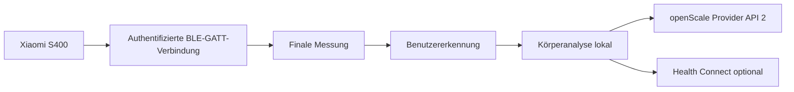

# ScaleLauncher

<p align="center">
  <a href="README.md">English</a> |
  <strong>Deutsch</strong>
</p>

<p align="center">
  <strong>Datenschutzfreundliche Android-App für die Xiaomi Body Composition Scale S400, openScale und optional Health Connect.</strong>
</p>

> **Kurz erklärt:** ScaleLauncher verbindet sich direkt per Bluetooth mit der Xiaomi S400, authentifiziert sich mit dem Login-Token der Waage, empfängt vollständige Messungen, erkennt den passenden Benutzer und speichert die lokal berechneten Körperwerte in openScale.

> **Stand dieser Anleitung: 24. August 2026**

## Wozu dient ScaleLauncher?

ScaleLauncher verbindet die **Xiaomi Body Composition Scale S400** direkt mit **openScale**.

Die App kann:

- die S400 im Hintergrund überwachen
- eine authentifizierte BLE-GATT-Verbindung zur Waage aufbauen
- Gewicht sowie beide Impedanzwerte empfangen
- Benutzer anhand von Referenzgewicht und Toleranz erkennen
- Körperanalysewerte lokal berechnen
- vollständige Messungen über openScale Provider API 2 speichern
- ausgewählte Werte optional an Health Connect übergeben
- mehrere ScaleLauncher-Handys eines Haushalts sicher miteinander verbinden

Für die tägliche Messung benötigt ScaleLauncher **keine Xiaomi-Cloud und keine Internetberechtigung**.

## Funktionsweise

ScaleLauncher scannt die S400 nicht nur passiv. Die App baut eine authentifizierte **BLE-GATT-Verbindung** auf. Nach erfolgreicher Anmeldung liefert die Waage Live-Gewichte und anschließend einen finalen Datensatz mit Gewicht und Dual-Impedanz.



## Voraussetzungen

| Voraussetzung | Hinweis |
|---|---|
| Xiaomi Body Composition Scale S400 | Andere Waagenmodelle werden derzeit nicht unterstützt. |
| Android 12 oder neuer | Mindestversion. |
| openScale | Provider API 2 erforderlich. |
| S400 MAC-Adresse | Format `AA:BB:CC:DD:EE:FF` |
| S400 Login-Token | Genau 24 Hex-Zeichen |
| Bluetooth | Muss eingeschaltet sein. |
| Benachrichtigungen | Für Hintergrundüberwachung und Messergebnisse. |
| Health Connect, optional | Direkte Übertragung ab Android 14. |

### Login-Token

ScaleLauncher verwendet den **12-Byte Login-Token** der S400:

```text
MAC:   AA:BB:CC:DD:EE:FF
TOKEN: 00112233445566778899AABB
```

Der Token besteht aus genau **24 hexadezimalen Zeichen**.

> Der frühere 32-stellige BLE-Bind-Key wird von der aktuellen GATT-Anmeldung nicht als Eingabefeld verwendet.

Der Token kann mit geeigneten Xiaomi-Token-Werkzeugen aus dem Xiaomi-Konto ausgelesen werden, nachdem die Waage in Xiaomi Home / Mi Home eingerichtet wurde.

Referenz:
- https://github.com/PiotrMachowski/Xiaomi-cloud-tokens-extractor

Veröffentliche den Token niemals in Screenshots, Protokollen oder Fehlerberichten.

## Installation

Die aktuelle APK kann über die GitHub-Releases installiert werden:

https://github.com/1260er/ScaleLauncher/releases

Alternativ kann Obtainium dieses Repository überwachen:

```text
https://github.com/1260er/ScaleLauncher
```

## Ersteinrichtung

Empfohlene Reihenfolge:

1. openScale installieren.
2. Benutzer in openScale anlegen.
3. Unter **Waage** die S400 auswählen.
4. MAC-Adresse und Login-Token speichern.
5. Unter **Berechtigungen** die Anforderungen erfüllen.
6. Unter **Benutzer** die Profile konfigurieren.
7. Health Connect bei Bedarf einrichten.
8. Überwachung starten.

### Waage

Unter **Waage** werden MAC-Adresse und Login-Token hinterlegt.

#### Waage wird nicht gefunden

Die S400 kann praktisch nur von **einem aktiven authentifizierten Bluetooth-Client gleichzeitig** verwendet werden.

Wird die Waage nicht gefunden:

1. Überwachung auf einem anderen ScaleLauncher-Handy beenden oder dort Bluetooth kurz ausschalten.
2. Xiaomi Home gegebenenfalls vollständig schließen.
3. Die Waage kurz betreten und aufwecken.
4. Suche erneut starten.

### Berechtigungen

Besonders wichtig sind:

- Bluetooth
- Benachrichtigungen
- Akkuoptimierung für ScaleLauncher deaktivieren
- Verwaltung bei Nichtnutzung deaktivieren

Diese Einstellungen helfen dabei, dass Android die dauerhafte Überwachung nicht im Hintergrund beendet.

## Benutzer und automatische Zuordnung

ScaleLauncher verwendet pro Benutzer unter anderem:

- Geburtstag
- Größe
- Geschlecht
- Referenzgewicht
- Gewichtstoleranz
- Ziel- beziehungsweise Besitzer-Handy

Die automatische Erkennung erfolgt primär über:

```text
Referenzgewicht ± Toleranz
```

Passt genau ein Benutzer, kann die Messung automatisch zugeordnet werden. Passen mehrere Benutzer, bleibt die Messung zur manuellen Zuordnung offen. Liegt das Gewicht außerhalb aller Toleranzen, bleibt sie ebenfalls unzugeordnet.

### Doppelte Namen

Namen sind **keine Identität**. Zwei Benutzer dürfen denselben Namen besitzen.

Intern besitzt jedes Haushaltsprofil eine eindeutige `householdProfileId`.

```text
Anna → Profil-ID A
Anna → Profil-ID B
```

Diese Profile bleiben vollständig getrennt.

## Mehrbenutzer und mehrere Handys

Unter **Benutzer → Mehrbenutzer** können ScaleLauncher-Handys eines Haushalts sicher miteinander verbunden werden.

Die S400 kann nur von einem Handy gleichzeitig aktiv genutzt werden. Dieses Handy übernimmt die **Collector-Rolle**. Andere ScaleLauncher-Handys warten im **Standby** und können übernehmen, wenn die Waage frei wird.

### Sicheres Koppeln

1. **Mehrbenutzer** auf beiden Handys öffnen.
2. Kopplung auf beiden Geräten starten.
3. Beide Geräte führen einen lokalen kryptografischen Schlüsselaustausch durch.
4. Auf beiden Geräten erscheint ein sechsstelliger Sicherheitscode.
5. Nur bestätigen, wenn beide Codes identisch sind.

### Welche Daten werden geteilt?

Für die gemeinsame Benutzererkennung werden nur notwendige Profildaten synchronisiert:

- eindeutige Haushalts-Profil-ID
- Name
- Besitzer-Handy
- Referenzgewicht
- Gewichtstoleranz
- Aktiv-Status
- Änderungszeitpunkt

Nicht als gemeinsames Haushaltsprofil synchronisiert werden insbesondere:

- Geburtstag
- Größe
- Geschlecht
- openScale-Benutzer-ID
- berechnete Körperanalysewerte

Diese Daten bleiben auf dem Besitzer-Handy.

### Besitzer-Handy

Jeder Benutzer besitzt ein Ziel- beziehungsweise Besitzer-Handy. Dort sollen Körperanalyse, openScale-Speicherung und optional Health Connect ausgeführt werden.

Die `householdProfileId` ist die eindeutige Identität. Namen werden niemals zum automatischen Zusammenführen verwendet.

### Aktueller Entwicklungsstand

Im Entwicklungszweig `ui-v1.2.0` sind bereits vorhanden:

- sichere BLE-Kopplung
- vertrauenswürdige Geräte
- verschlüsselte Peer-Kommunikation
- Haushalts-Profil-IDs
- Profil-Synchronisierung
- persistente Outbox
- Empfangs-Deduplizierung
- ACK-Bestätigungen
- Collector-/Standby-Grundfunktion

Die endgültige automatische Weiterleitung und Zuordnung von Messungen zwischen Besitzer-Handys befindet sich noch in Entwicklung und wird vor Freigabe mit mehreren realen Handys getestet.

## Health Connect

Health Connect ist optional. Für den ausgewählten Benutzer können unter anderem übertragen werden:

- Gewicht
- Körperfett
- Körperwasser
- Knochenmasse
- fettfreie Masse
- Grundumsatz
- für BMI benötigte Werte

ScaleLauncher liest keine Gesundheitsdaten aus Health Connect zurück.

## Tägliche Nutzung

1. **Überwachen** starten.
2. ScaleLauncher verbindet sich mit der S400 oder wartet im Standby.
3. Auf die Waage steigen und die Messung vollständig durchführen.
4. ScaleLauncher empfängt den finalen Datensatz.
5. Der Benutzer wird erkannt oder die Messung bleibt offen.
6. Körperanalyse wird lokal berechnet.
7. Vollständige Werte werden in openScale gespeichert.
8. Optional werden ausgewählte Werte an Health Connect geschrieben.

## Fehlerbehebung

### Waage wird nicht gefunden

Mögliche Ursachen:

- anderes Handy hält bereits die S400-Verbindung
- Xiaomi Home kommuniziert mit der Waage
- Waage schläft
- Bluetooth ist aus
- Bluetooth-Berechtigung fehlt

### Anmeldung an der Waage schlägt fehl

Prüfe:

- MAC-Adresse korrekt
- Token genau 24 Hex-Zeichen
- Token gehört zu dieser S400
- Waage wurde nach dem Auslesen nicht zurückgesetzt oder erneut in Xiaomi Home eingerichtet

### Überwachung funktioniert erst nach Stoppen und erneutem Starten

Aktiviere das Diagnoseprotokoll und prüfe insbesondere GATT-Status, Standby, Neuverbindungsversuche und Authentifizierung.

### Messung wird nicht automatisch zugeordnet

Prüfe Referenzgewicht und Toleranz. Liegen mehrere Profile gleichzeitig im Toleranzbereich, ist die Messung absichtlich mehrdeutig.

### openScale wird nicht beschrieben

Prüfe:

- openScale installiert
- Zugriff erlaubt
- Provider API 2 verfügbar
- Benutzer auf diesem Handy vorhanden
- Benutzerprofil vollständig

## Datenschutz

ScaleLauncher ist auf lokale Verarbeitung ausgelegt.

- Kommunikation mit der Waage erfolgt direkt über Bluetooth.
- Für normale Messungen ist keine Xiaomi-Cloud erforderlich.
- ScaleLauncher besitzt keine Internetberechtigung.
- Gekoppelte ScaleLauncher-Handys kommunizieren direkt über Bluetooth.
- Peer-Nachrichten werden verschlüsselt übertragen.
- Persönliche Körperdaten und lokale openScale-Benutzer-IDs bleiben auf dem Besitzer-Handy.
- Nur ausdrücklich ausgewählte Werte werden an Health Connect geschrieben.

## Bekannte Einschränkungen

- Nur Xiaomi Body Composition Scale S400.
- openScale Provider API 2 erforderlich.
- Direkte Health-Connect-Übertragung benötigt Android 14 oder neuer.
- Die S400 erlaubt nur eine aktive authentifizierte Verbindung gleichzeitig.
- Mehrbenutzer-Messungsrouting befindet sich noch in der abschließenden Implementierungs- und Testphase.
- Änderungen an Xiaomi-Firmware oder Mi-Home-Protokoll können die Kompatibilität beeinflussen.

## Projekt selbst bauen

Voraussetzungen:

- JDK 17
- Android SDK
- Gradle 8.x

Debug-Build:

```bash
gradle :app:assembleDebug
```

Aktuelle Android-Konfiguration:

```text
minSdk 31
targetSdk 35
compileSdk 35
```

## Lizenz

ScaleLauncher steht unter der **GNU General Public License v3.0 only**.

Siehe [LICENSE](LICENSE).

## Danksagung

Hilfreiche öffentliche Referenzen:

- https://github.com/nokistin/xiaomi-s400-live
- https://github.com/PiotrMachowski/Xiaomi-cloud-tokens-extractor

ScaleLauncher ist ein unabhängiges Projekt und steht nicht in Verbindung mit Xiaomi oder openScale.
