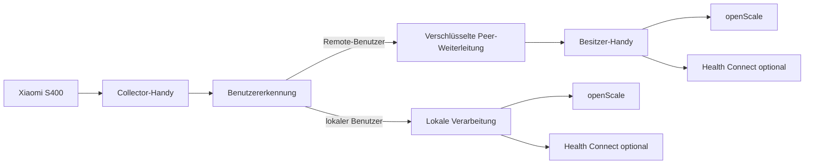

# ScaleLauncher

<p align="center">
  <a href="README.md">English</a> |
  <strong>Deutsch</strong>
</p>

<p align="center">
  <strong>Datenschutzfreundliche Android-App für die Xiaomi Body Composition Scale S400, openScale und optional Health Connect.</strong>
</p>

> ScaleLauncher verbindet sich direkt per Bluetooth mit der Xiaomi S400, authentifiziert sich mit dem Login-Token der Waage, empfängt vollständige Messungen, ordnet sie dem richtigen lokalen oder entfernten Haushaltsbenutzer zu und speichert die lokal berechneten Körperwerte in openScale.

> **Stand dieser Dokumentation: 2. September 2026**

## Status

ScaleLauncher 1.5.0 wurde mit dev-262 auf Commit `a97e872` praktisch abgenommen. Diese Version stellt die Build-Toolchain auf Java 21 um und deaktiviert Android-Abhängigkeitsmetadaten in APK und App Bundle zur besseren F-Droid-Kompatibilität und Unterstützung reproduzierbarer Builds. Messlogik, BLE-Verhalten, Routing und Benutzerzuordnung bleiben gegenüber 1.4.0 funktional unverändert.

Geprüft wurden unter anderem:

- wiederholte S400-Erkennung ohne Neustart der Überwachung
- lokale und entfernte Benutzerzuordnung
- mehrdeutige Messungen und manuelle Entscheidungen
- NO_MATCH und manuelles Rescue
- persistente offene Messungen
- sichere Weiterleitung zwischen mehreren Handys
- Bluetooth-Ausfall und automatische Peer-Wiederherstellung
- persistente Retries und Empfangs-Deduplizierung
- ACK-basierter Abschluss
- Wechsel der Collector-Rolle
- Benachrichtigungen bei nicht geöffneter App
- manuelle Zuordnung zu einem gültigen lokalen Benutzer außerhalb der automatischen Gewichtskandidaten

Der vollständige Regressionstest und das dokumentierte Abnahmeergebnis stehen in [TESTPLAN.md](TESTPLAN.md).

Die Abnahme von 1.4.0 bleibt die technische Regressionsbasis für das Anwendungsverhalten. Für 1.5.0 wurden Java-21-Build, App-Start, Dienststart, eine normale Messung und geräteübergreifendes Routing gezielt nachgeprüft und mit dev-262 abgenommen.

## Wozu dient ScaleLauncher?

ScaleLauncher verbindet die **Xiaomi Body Composition Scale S400** direkt mit **openScale**.

Die App kann:

- die S400 im Hintergrund überwachen
- eine authentifizierte BLE-GATT-Verbindung zur Waage aufbauen
- Gewicht sowie beide Impedanzwerte empfangen
- Benutzer anhand von Referenzgewicht und Toleranz erkennen
- mehrdeutige oder unpassende Messungen für eine manuelle Entscheidung offenhalten
- Körperanalysewerte lokal auf dem Besitzer-Handy berechnen
- vollständige Messungen über openScale Provider API 2 speichern
- ausgewählte Werte optional an Health Connect übergeben
- mehrere ScaleLauncher-Handys eines Haushalts sicher miteinander verbinden
- Messungen an das richtige Besitzer-Handy weiterleiten, auch wenn ein anderes Handy gerade Collector ist

Für die tägliche Messung benötigt ScaleLauncher **keine Xiaomi-Cloud und keine Internetberechtigung**.

## Funktionsweise

Die S400 erlaubt nur einen aktiven authentifizierten Bluetooth-Client gleichzeitig. ScaleLauncher trennt deshalb das Handy mit der aktuellen Waagenverbindung vom Handy, das die Daten eines Benutzers besitzt.



Der **Collector** ist einfach das Handy, das aktuell die Verbindung zur S400 hält. Es gibt kein dauerhaftes Hauptgerät. Ein anderes gekoppeltes Handy kann die Rolle übernehmen, wenn sich Bluetooth oder die Verfügbarkeit ändert.

## Voraussetzungen

| Voraussetzung | Hinweis |
|---|---|
| Xiaomi Body Composition Scale S400 | Praktisch getestet mit `yunmai.scales.ms104`. |
| Android 12 oder neuer | `minSdk 31` |
| openScale | Provider API 2 erforderlich |
| S400 MAC-Adresse | Format `AA:BB:CC:DD:EE:FF` |
| S400 Login-Token | Genau 24 hexadezimale Zeichen |
| Bluetooth | Erforderlich |
| Benachrichtigungen | Für Hintergrundüberwachung und Zuordnungshinweise |
| Health Connect, optional | Direkte Übertragung ab Android 14 |

### Andere Xiaomi-Waagen

Praktisch verifiziert ist derzeit die **Xiaomi Body Composition Scale S400 `yunmai.scales.ms104`**.

Nahe S400-Varianten könnten kompatibel sein, wenn sie dasselbe authentifizierte GATT-Protokoll verwenden, werden derzeit aber nicht garantiert. Ältere Xiaomi-Waagen wie die Mi Body Composition Scale 2 verwenden eine andere Bluetooth-Architektur und sind nicht automatisch kompatibel.

## Login-Token

ScaleLauncher verwendet den **12-Byte Login-Token** der S400:

```text
MAC:   AA:BB:CC:DD:EE:FF
TOKEN: 00112233445566778899AABB
```

Der Token besteht aus genau **24 hexadezimalen Zeichen**.

Der frühere 32-stellige BLE-Bind-Key wird von der aktuellen GATT-Anmeldung nicht als Zugangsdatenfeld verwendet.

Ein Token kann nach dem Hinzufügen der Waage zu Xiaomi Home / Mi Home mit einem geeigneten Xiaomi-Token-Werkzeug ausgelesen werden, zum Beispiel:

- https://github.com/PiotrMachowski/Xiaomi-cloud-tokens-extractor

Veröffentliche den Token niemals in Screenshots, Protokollen oder Fehlerberichten.

## Wichtig: Xiaomi Home danach nicht parallel verwenden

Die S400 kann nur **eine aktive Bluetooth-Verbindung gleichzeitig** halten.

Empfohlene Einrichtung:

1. S400 zunächst in Xiaomi Home / Mi Home einrichten.
2. MAC-Adresse und Login-Token auslesen.
3. Beide Werte in ScaleLauncher speichern.
4. S400 anschließend in Xiaomi Home über **Gerät löschen** entfernen.
5. Die Waage dabei **nicht auf Werkseinstellungen zurücksetzen**.
6. Danach ScaleLauncher für die laufende Überwachung verwenden.

Ein Factory Reset oder erneutes Hinzufügen zu Xiaomi Home kann einen neuen Token erzeugen.

## Installation

Stabile, vom Entwickler signierte APKs werden über GitHub Releases veröffentlicht:

https://github.com/1260er/ScaleLauncher/releases

ScaleLauncher enthält außerdem die Metadaten und die Unterstützung für einen unabhängigen Quellbuild zur Verteilung über F-Droid und IzzyOnDroid. Die Verfügbarkeit in diesen Repositories kann einem GitHub-Release zeitlich folgen, da Aufnahme und Aktualisierung dort unabhängig verarbeitet werden.

Alternativ kann Obtainium das GitHub-Repository überwachen:

```text
https://github.com/1260er/ScaleLauncher
```

## Ersteinrichtung

1. openScale installieren und dort die Benutzer anlegen, deren Messungen auf diesem Handy lokal gespeichert werden sollen.
2. Die S400 **nicht als Bluetooth-Waage in openScale koppeln**.
3. S400 vorübergehend in Xiaomi Home einrichten.
4. MAC-Adresse und Login-Token auslesen.
5. Waage aus Xiaomi Home entfernen, ohne sie zurückzusetzen.
6. Unter **Waage** MAC-Adresse und Login-Token speichern.
7. Unter **Berechtigungen** alle Anforderungen erfüllen.
8. Jeden lokalen Benutzer unter **Benutzer** konfigurieren.
9. Bei mehreren Handys diese unter **Benutzer → Mehrbenutzer** koppeln.
10. Health Connect bei Bedarf konfigurieren.
11. Überwachung starten.

## openScale-Integration

ScaleLauncher übernimmt die Bluetooth-Verbindung zur S400. openScale dient über **Provider API 2** als lokale Messdatenbank.

Deshalb gilt:

- gewünschte Benutzer in openScale anlegen
- ScaleLauncher den Provider-Zugriff erlauben
- openScale selbst nicht zusätzlich per Bluetooth mit der S400 verbinden

Ein zweiter Bluetooth-Client würde mit der exklusiven S400-Verbindung von ScaleLauncher konkurrieren.

## Benutzererkennung

Ein ScaleLauncher-Benutzerprofil enthält die für lokale Berechnung und Zuordnung notwendigen Daten, darunter:

- Geburtstag
- Größe
- Geschlecht
- Referenzgewicht
- Gewichtstoleranz

Die automatische Erkennung erfolgt primär über:

```text
Referenzgewicht ± Toleranz
```

Passt genau ein gültiges Haushaltsprofil, kann ScaleLauncher die Messung automatisch weiterleiten.

Passen mehrere Profile, bleibt die Messung zur Entscheidung offen.

Passt kein Profil, bleibt die Messung unzugeordnet und kann manuell behandelt werden.

Das Gewicht begrenzt nur die **automatische** Kandidatenerkennung. Wenn eine menschliche Entscheidung erforderlich ist, kann der Collector eine offene Messung auch einem anderen gültigen lokalen Benutzer zuordnen, selbst wenn dessen Referenzgewicht außerhalb der automatischen Kandidaten lag.

## Mehrbenutzer und mehrere Handys

### Besitzer-Handy und Collector

Jeder Benutzer gehört zu einem **Besitzer-Handy**. Dort liegen die persönlichen Körperdaten und dort erfolgen:

- Körperanalyse
- Speicherung in openScale
- optional Health-Connect-Übertragung

Das Handy mit der aktuellen S400-Verbindung ist der **Collector**.

Jedes gekoppelte ScaleLauncher-Handy kann Collector werden. Die Rolle kann automatisch wechseln und ändert nichts an der Benutzerzuordnung.

### Alle beteiligten Handys direkt koppeln

Für zuverlässigen Betrieb sollten alle beteiligten ScaleLauncher-Handys direkt miteinander gekoppelt werden.

Bei drei Handys:

```text
Handy A ↔ Handy B
Handy A ↔ Handy C
Handy B ↔ Handy C
```

Jedes Handy kann Collector werden und muss deshalb jedes mögliche Besitzer-Handy erreichen können.

### Sicheres Koppeln

1. Auf beiden Geräten **Benutzer → Mehrbenutzer** öffnen.
2. Kopplung auf beiden Handys starten.
3. ScaleLauncher führt einen lokalen kryptografischen Schlüsselaustausch durch.
4. Beide Geräte zeigen einen sechsstelligen Sicherheitscode.
5. Nur bestätigen, wenn beide Codes identisch sind.

### Geteilte Haushaltsdaten

Zwischen gekoppelten Handys werden nur notwendige Erkennungsdaten synchronisiert:

- eindeutige Haushalts-Profil-ID
- Name
- Besitzer-Handy
- Referenzgewicht
- Toleranz
- Aktiv-Status
- Änderungszeitpunkt

Persönliche Profildaten wie Geburtstag, Größe, Geschlecht, lokale openScale-Benutzer-ID und berechnete Körperanalysewerte bleiben auf dem Besitzer-Handy.

### Zuverlässige Zustellung

Die Peer-Weiterleitung verwendet:

- persistente Outbox
- Retry nach vorübergehendem Bluetooth-Ausfall
- Empfangs-Deduplizierung
- ACK-Bestätigung vor dem endgültigen Abschluss

Dadurch geht eine Entscheidung bei einer vorübergehenden Funkunterbrechung nicht verloren und eine erneut gesendete Messung erzeugt keinen doppelten openScale-Eintrag.

## Benachrichtigungen

ScaleLauncher kann beteiligte Handys über eine unzugeordnete Messung informieren, auch wenn die App-Oberfläche nicht geöffnet ist.

Die Überwachung muss weiter aktiv sein und Android muss Benachrichtigungen erlauben.

## Health Connect

Health Connect ist optional. Für den ausgewählten lokalen Benutzer kann ScaleLauncher unterstützte Werte schreiben, zum Beispiel:

- Gewicht
- Körperfett
- Körperwasser
- Knochenmasse
- fettfreie Masse
- Grundumsatz
- Werte für BMI

ScaleLauncher liest keine Gesundheitsdaten aus Health Connect zurück.

## Tägliche Nutzung

1. Auf den beteiligten Handys **Überwachen** starten.
2. Ein Handy wird Collector, die anderen stehen als Peers bereit.
3. Auf die S400 steigen und die Messung vollständig durchführen.
4. ScaleLauncher empfängt den finalen Datensatz.
5. Der Benutzer wird automatisch erkannt oder die Messung bleibt offen.
6. Falls nötig, die Zuordnung auf einem benachrichtigten Gerät entscheiden.
7. Das Besitzer-Handy berechnet die Körperwerte.
8. Die Messung wird genau einmal in openScale gespeichert.
9. Ausgewählte Werte können optional an Health Connect geschrieben werden.

Ein dauerhaft festgelegtes Haupthandy ist nicht erforderlich.

## Fehlerbehebung

### Waage wird nicht gefunden

Prüfen, ob:

- ein anderes Handy bereits die S400-Verbindung hält
- Xiaomi Home noch mit der Waage kommuniziert
- openScale selbst mit der S400 gekoppelt wurde
- Bluetooth ausgeschaltet ist
- Bluetooth-Berechtigungen fehlen
- die Waage schläft

Waage kurz aufwecken und erneut versuchen.

### Authentifizierung schlägt fehl

Prüfen:

- MAC-Adresse
- 24-stelligen Login-Token
- ob der Token zu dieser S400 gehört
- ob die Waage nach dem Auslesen zurückgesetzt oder erneut in Xiaomi Home hinzugefügt wurde

### Überwachung funktioniert erst nach Stop/Start

Das sollte im technisch abgenommenen Stand nicht erforderlich sein. Diagnoseprotokoll aktivieren und BLE-Scan, GATT, Collector/Standby und Peer-Transport prüfen.

### Remote-Zuordnung dauert etwas länger

Bei vorübergehendem Bluetooth-Ausfall kann die Zustellung verzögert sein. ScaleLauncher hält Peer-Nachrichten persistent vor und versucht die Zustellung nach Rückkehr der Verbindung erneut. Die Zuordnung kann kurz als „wird abgeschlossen“ erscheinen, bis das Remote-ACK angekommen ist.

### openScale erhält keine Messung

Prüfen:

- openScale installiert
- Provider-Zugriff erteilt
- Provider API 2 verfügbar
- Zielbenutzer auf dem Besitzer-Handy vorhanden
- lokales ScaleLauncher-Benutzerprofil vollständig

## Datenschutz

ScaleLauncher ist auf lokale Verarbeitung ausgelegt.

- Waagenkommunikation erfolgt direkt per Bluetooth.
- Normale Messungen benötigen keine Xiaomi-Cloud.
- ScaleLauncher besitzt keine Internetberechtigung.
- Gekoppelte ScaleLauncher-Handys kommunizieren direkt per Bluetooth.
- Peer-Nachrichten sind verschlüsselt.
- Persönliche Körperprofildaten und lokale openScale-Benutzer-IDs bleiben auf dem Besitzer-Handy.
- Nur ausdrücklich ausgewählte Werte werden an Health Connect geschrieben.

Ausführliche Datenschutzinformationen stehen in [PRIVACY.de.md](PRIVACY.de.md). Die Lizenzierung der Projekt-Assets ist in [ASSETS.md](ASSETS.md) dokumentiert.

## Technisch abgenommener Stand

Die praktische Abnahme ist in [TESTPLAN.md](TESTPLAN.md) dokumentiert.

Abnahme-Build:

```text
Dev-Build: dev-262
Branch: ui-v1.5.0
Technischer Abnahme-Commit: a97e872
Abnahmedatum: 2026-09-02
```

Dieser Eintrag dokumentiert die praktisch getestete technische Basis. Spätere reine Dokumentationsänderungen können neuere Commits verwenden, ohne das getestete Anwendungsverhalten zu verändern.

## Projekt bauen

Voraussetzungen:

- JDK 21
- Android SDK
- Gradle 8.x

Debug-Build:

```bash
gradle :app:assembleDebug
```

Release-/Quellbuild:

```bash
gradle --no-daemon clean testDebugUnitTest assembleRelease
```

Der Release-Quellbuild benötigt keinen privaten ScaleLauncher-Signierschlüssel. Dadurch kann F-Droid die APK unabhängig aus dem Quellcode bauen.

Der offizielle GitHub-Workflow für stabile Releases verlangt die privaten, dauerhaft verwendeten Release-Signierdaten, bevor eine signierte APK erzeugt werden kann.

Aktuelle Android-Konfiguration:

```text
minSdk 31
targetSdk 35
compileSdk 35
versionCode 6
versionName 1.5.0
```

## Lizenz

ScaleLauncher steht unter der **GNU General Public License v3.0 only**.

Siehe [LICENSE](LICENSE).

## Credits

Nützliche öffentliche Referenzen:

- https://github.com/nokistin/xiaomi-s400-live
- https://github.com/PiotrMachowski/Xiaomi-cloud-tokens-extractor

ScaleLauncher ist ein unabhängiges Projekt und steht in keiner Verbindung zu Xiaomi oder openScale.
