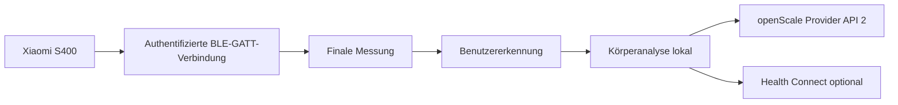

# ScaleLauncher

<p align="center">
  <a href="README.md">English</a> |
  <strong>Deutsch</strong>
</p>

<p align="center">
  <strong>Datenschutzfreundliche Android-App für die Xiaomi Body Composition Scale S400, openScale und optional Health Connect.</strong>
</p>

> **Kurz erklärt:** ScaleLauncher verbindet sich direkt per Bluetooth mit der Xiaomi S400, authentifiziert sich mit dem Login-Token der Waage, empfängt vollständige Messungen, erkennt den passenden Benutzer und speichert die lokal berechneten Körperwerte in openScale.

> **Stand dieser Anleitung: 24. August 2026**

## Wozu dient ScaleLauncher?

ScaleLauncher verbindet die **Xiaomi Body Composition Scale S400** direkt mit **openScale**.

Die App kann:

- die S400 im Hintergrund überwachen
- eine authentifizierte BLE-GATT-Verbindung zur Waage aufbauen
- Gewicht sowie beide Impedanzwerte empfangen
- Benutzer anhand von Referenzgewicht und Toleranz erkennen
- Körperanalysewerte lokal berechnen
- vollständige Messungen über openScale Provider API 2 speichern
- ausgewählte Werte optional an Health Connect übergeben
- mehrere ScaleLauncher-Handys eines Haushalts sicher miteinander verbinden

Für die tägliche Messung benötigt ScaleLauncher **keine Xiaomi-Cloud und keine Internetberechtigung**.

## Funktionsweise

ScaleLauncher scannt die S400 nicht nur passiv. Die App baut eine authentifizierte **BLE-GATT-Verbindung** auf. Nach erfolgreicher Anmeldung liefert die Waage Live-Gewichte und anschließend einen finalen Datensatz mit Gewicht und Dual-Impedanz.



## Voraussetzungen

| Voraussetzung | Hinweis |
|---|---|
| Xiaomi Body Composition Scale S400 | Getestet mit `yunmai.scales.ms104`. Weitere S400-Varianten könnten kompatibel sein, sind aber nicht getestet. |
| Android 12 oder neuer | Mindestversion. |
| openScale | Provider API 2 erforderlich. |
| S400 MAC-Adresse | Format `AA:BB:CC:DD:EE:FF` |
| S400 Login-Token | Genau 24 Hex-Zeichen |
| Bluetooth | Muss eingeschaltet sein. |
| Benachrichtigungen | Für Hintergrundüberwachung und Messergebnisse. |
| Health Connect, optional | Direkte Übertragung ab Android 14. |

### Andere Xiaomi-Körperwaagen

ScaleLauncher ist derzeit praktisch mit der **Xiaomi Body Composition Scale S400 `yunmai.scales.ms104`** getestet.

#### Nahe S400-Varianten

Technisch eng verwandt sind:

- S400 `yunmai.scales.ms103`
- S400 Blue `yunmai.scales.ms107`
- S400 Pro `xiaomi.scales.ms110`

Diese Modelle liefern ebenfalls Gewicht sowie Low-/High-Impedanz und gehören zur S400-Familie. Sie könnten mit ScaleLauncher kompatibel sein, wurden jedoch noch nicht praktisch getestet. Eine Kompatibilität wird deshalb derzeit nicht garantiert.

#### Xiaomi S800

Die **Xiaomi Mijia Eight-Electrode Body Fat Scale S800 `xiaomi.scales.ms116` / `MJTZC04YM`** verwendet ebenfalls verschlüsselte Xiaomi-Bluetooth-Kommunikation, besitzt jedoch eine andere Messarchitektur mit acht Elektroden und segmentaler Körperanalyse.

Gewicht kann bei diesem Modell über verschlüsselte MiBeacon-Daten übertragen werden. Die vollständigen 8-Elektroden-Messwerte benötigen jedoch einen eigenen verschlüsselten GATT-Datenweg.

Die S800 wird deshalb von der aktuellen ScaleLauncher-S400-Implementierung **nicht unterstützt**. Sie ist ein möglicher Kandidat für eine spätere Erweiterung, benötigt dafür aber eine eigene Protokollanalyse und reale Tests.

#### Ältere Xiaomi-Waagen

Ältere Modelle wie die **Mi Body Composition Scale 2** verwenden ein anderes Bluetooth-Verfahren mit passiven BLE-Werbepaketen. Sie sind nicht mit der aktuellen authentifizierten S400-GATT-Implementierung kompatibel.

### Login-Token

ScaleLauncher verwendet den **12-Byte Login-Token** der S400:

```text
MAC:   AA:BB:CC:DD:EE:FF
TOKEN: 00112233445566778899AABB
```

Der Token besteht aus genau **24 hexadezimalen Zeichen**.

> Der frühere 32-stellige BLE-Bind-Key wird von der aktuellen GATT-Anmeldung nicht als Eingabefeld verwendet.

Der Token kann mit geeigneten Xiaomi-Token-Werkzeugen aus dem Xiaomi-Konto ausgelesen werden, nachdem die Waage in Xiaomi Home / Mi Home eingerichtet wurde.

Referenz:
- https://github.com/PiotrMachowski/Xiaomi-cloud-tokens-extractor

Veröffentliche den Token niemals in Screenshots, Protokollen oder Fehlerberichten.

### Wichtig: Xiaomi Home danach nicht parallel verwenden

Die S400 kann nur **eine aktive Bluetooth-Verbindung gleichzeitig** halten. Xiaomi Home und ScaleLauncher können die Waage deshalb nicht gleichzeitig zuverlässig verwenden.

Für den ScaleLauncher-Betrieb wird folgende Reihenfolge empfohlen:

1. S400 zunächst in Xiaomi Home / Mi Home einrichten.
2. MAC-Adresse und Login-Token auslesen.
3. MAC-Adresse und Token in ScaleLauncher speichern.
4. Die S400 anschließend in Xiaomi Home über **Gerät löschen** entfernen.
5. Die Waage dabei **nicht auf Werkseinstellungen zurücksetzen**.
6. Danach die Waage ausschließlich über ScaleLauncher überwachen.

Ein Factory Reset oder ein erneutes Hinzufügen der Waage in Xiaomi Home kann einen neuen Login-Token erzeugen. Dann muss der aktuelle Token erneut ausgelesen und in ScaleLauncher eingetragen werden.


## Installation

Die aktuelle APK kann über die GitHub-Releases installiert werden:

https://github.com/1260er/ScaleLauncher/releases

Alternativ kann Obtainium dieses Repository überwachen:

```text
https://github.com/1260er/ScaleLauncher
```

## Ersteinrichtung

Empfohlene Reihenfolge:

1. openScale installieren und dort den oder die Benutzer anlegen, deren Messdaten auf diesem Handy lokal verwaltet werden sollen. Normalerweise verwendet jeder Benutzer sein eigenes Handy.
2. Die S400 **nicht als Bluetooth-Waage in openScale koppeln**.
3. S400 vorübergehend in Xiaomi Home einrichten.
4. MAC-Adresse und Login-Token auslesen.
5. Die S400 anschließend aus Xiaomi Home löschen, aber **nicht resetten**.
6. Unter **Waage** MAC-Adresse und Login-Token speichern.
7. Unter **Berechtigungen** die Anforderungen erfüllen.
8. Unter **Benutzer** die Profile konfigurieren.
9. Health Connect bei Bedarf einrichten.
10. Überwachung starten.

### openScale

openScale wird zusammen mit ScaleLauncher **nicht direkt mit der S400 gekoppelt**.

ScaleLauncher übernimmt die komplette Bluetooth-Verbindung zur Waage und schreibt die fertige Messung anschließend über die **openScale Provider API 2** in den passenden lokalen openScale-Benutzer.

Deshalb gilt:

- Benutzer in openScale anlegen
- ScaleLauncher den openScale-Zugriff erlauben
- die S400 **nicht zusätzlich in openScale als Waage verbinden**

Eine zusätzliche Bluetooth-Verbindung durch openScale würde mit der exklusiven S400-Verbindung von ScaleLauncher konkurrieren.

### Waage

Unter **Waage** werden MAC-Adresse und Login-Token hinterlegt.

#### Waage wird nicht gefunden

Die S400 kann praktisch nur von **einem aktiven authentifizierten Bluetooth-Client gleichzeitig** verwendet werden.

Wird die Waage nicht gefunden:

1. Prüfen, ob ein anderes ScaleLauncher-Handy die Waage bereits verwendet.
2. Prüfen, ob die S400 noch in Xiaomi Home aktiv ist. Für ScaleLauncher sollte sie dort nach dem Auslesen des Tokens entfernt sein.
3. Prüfen, ob openScale selbst mit der S400 gekoppelt wurde. Diese Kopplung ist für ScaleLauncher nicht erforderlich und sollte entfernt werden.
4. Gegebenenfalls Bluetooth auf dem anderen Handy kurz ausschalten.
5. Die Waage kurz betreten und aufwecken.
6. Suche erneut starten.

### Berechtigungen

Besonders wichtig sind:

- Bluetooth
- Benachrichtigungen
- Akkuoptimierung für ScaleLauncher deaktivieren
- Verwaltung bei Nichtnutzung deaktivieren

Diese Einstellungen helfen dabei, dass Android die dauerhafte Überwachung nicht im Hintergrund beendet.

## Benutzer und automatische Zuordnung

ScaleLauncher verwendet pro Benutzer unter anderem:

- Geburtstag
- Größe
- Geschlecht
- Referenzgewicht
- Gewichtstoleranz
- Ziel- beziehungsweise Besitzer-Handy

Die automatische Erkennung erfolgt primär über:

```text
Referenzgewicht ± Toleranz
```

Passt genau ein Benutzer, kann die Messung automatisch zugeordnet werden. Passen mehrere Benutzer, bleibt die Messung zur manuellen Zuordnung offen. Liegt das Gewicht außerhalb aller Toleranzen, bleibt sie ebenfalls unzugeordnet.

### Doppelte Namen

Namen sind **keine Identität**. Zwei Benutzer dürfen denselben Namen besitzen.

Intern besitzt jedes Haushaltsprofil eine eindeutige `householdProfileId`.

```text
Anna → Profil-ID A
Anna → Profil-ID B
```

Diese Profile bleiben vollständig getrennt.

## Mehrbenutzer und mehrere Handys

Unter **Benutzer → Mehrbenutzer** können die ScaleLauncher-Handys eines Haushalts zu einem gemeinsamen Verbund gekoppelt werden.

### Warum ist der Mehrbenutzerbetrieb notwendig?

Die S400 erlaubt nur **eine aktive authentifizierte Bluetooth-Verbindung gleichzeitig**.

Deshalb kann immer nur ein ScaleLauncher-Handy direkt mit der Waage verbunden sein. Dieses Handy übernimmt die **Collector-Rolle** und empfängt die vollständige Messung.

Der Mehrbenutzerbetrieb trennt die aktuelle Waagenverbindung vom Besitzer einer Messung:

1. Ein beliebiges ScaleLauncher-Handy im Haushalt verbindet sich als Collector mit der S400.
2. Der Collector empfängt die vollständige Messung.
3. Anhand der synchronisierten Haushaltsprofile wird geprüft, welcher Benutzer zur Messung passt.
4. Die Messung wird verschlüsselt an das Besitzer-Handy des passenden Benutzers weitergeleitet.
5. Erst auf diesem Besitzer-Handy werden die persönlichen Körperdaten verwendet und die Körperanalyse berechnet.
6. Dort wird die Messung anschließend in openScale und optional in Health Connect gespeichert.

Dadurch kann jeder Benutzer im Haushalt die gemeinsame Waage verwenden, **unabhängig davon, welches ScaleLauncher-Handy gerade die exklusive Verbindung zur S400 hält**.

Bei einer eindeutigen Benutzererkennung muss nur das zuständige Besitzer-Handy erreicht werden.

Sind mehrere Benutzer aufgrund ihrer Gewichtstoleranzen möglich, muss der Collector die Messung an alle infrage kommenden Besitzer-Handys übertragen können, damit die Zuordnung dort korrekt abgeschlossen werden kann.

### Alle Handys müssen miteinander gekoppelt sein

Für einen zuverlässigen Mehrbenutzerbetrieb müssen **alle beteiligten ScaleLauncher-Handys direkt miteinander gekoppelt sein**.

Es reicht nicht aus, die Geräte nur in einer Kette zu verbinden.

Beispiel mit drei Handys:

```text
Handy A ↔ Handy B
Handy A ↔ Handy C
Handy B ↔ Handy C
```

Der Grund dafür ist die Collector-Rolle:

**Jedes Handy kann zum Collector werden und muss anschließend jedes mögliche Besitzer-Handy direkt erreichen können.**

Es gibt deshalb kein festes Haupt-Handy und kein dauerhaft festgelegtes Collector-Handy.

Das Koppeln erfolgt immer zwischen zwei Handys. Bei mehr als zwei Geräten wird der Kopplungsvorgang so oft wiederholt, bis jedes Handy mit jedem anderen Handy verbunden ist.

### Collector und Standby

Nur ein Handy kann die S400 gleichzeitig aktiv verwenden. Dieses Handy ist der **Collector**.

Alle anderen ScaleLauncher-Handys warten im **Standby**.

Wird die Waage frei oder der bisherige Collector ist nicht mehr verfügbar, kann ein anderes Handy die Verbindung übernehmen.

Welches Handy gerade Collector ist, ist für die Benutzerzuordnung nicht entscheidend. Wichtig ist, dass der Collector jedes mögliche Besitzer-Handy direkt erreichen kann.

### Sicheres Koppeln

Für jedes noch nicht verbundene Handypaar:

1. Auf beiden Geräten **Benutzer → Mehrbenutzer** öffnen.
2. Kopplung auf beiden Geräten starten.
3. Die Geräte führen einen lokalen kryptografischen Schlüsselaustausch durch.
4. Auf beiden Geräten erscheint ein sechsstelliger Sicherheitscode.
5. Nur bestätigen, wenn beide Codes identisch sind.
6. Den Vorgang mit den übrigen Handypaaren wiederholen.

### Welche Daten werden geteilt?

Für die gemeinsame Benutzererkennung werden nur notwendige Profildaten synchronisiert:

- eindeutige Haushalts-Profil-ID
- Name
- Besitzer-Handy
- Referenzgewicht
- Gewichtstoleranz
- Aktiv-Status
- Änderungszeitpunkt

Nicht als gemeinsames Haushaltsprofil synchronisiert werden insbesondere:

- Geburtstag
- Größe
- Geschlecht
- openScale-Benutzer-ID
- berechnete Körperanalysewerte

Diese persönlichen Daten bleiben auf dem Besitzer-Handy.

### Besitzer-Handy

Jeder Benutzer besitzt ein Ziel- beziehungsweise **Besitzer-Handy**.

Dort werden:

- die persönlichen Profildaten vorgehalten
- die Körperanalyse berechnet
- die Messung in openScale gespeichert
- optional Werte an Health Connect übertragen

Die `householdProfileId` ist die eindeutige Identität eines Benutzers im Haushaltsverbund. Namen werden niemals zum automatischen Zusammenführen von Profilen verwendet.

### Aktueller Entwicklungsstand

Im Entwicklungszweig `ui-v1.2.0` sind bereits vorhanden:

- sichere BLE-Kopplung
- mehrere vertrauenswürdige Geräte
- verschlüsselte Peer-Kommunikation
- Haushalts-Profil-IDs
- Profil-Synchronisierung
- persistente Outbox
- Empfangs-Deduplizierung
- ACK-Bestätigungen
- Collector-/Standby-Grundfunktion

Die endgültige automatische Weiterleitung und Zuordnung der Messungen zwischen den Besitzer-Handys befindet sich noch in Entwicklung und wird vor der Freigabe mit mehreren realen Handys getestet.

## Health Connect

Health Connect ist optional. Für den ausgewählten Benutzer können unter anderem übertragen werden:

- Gewicht
- Körperfett
- Körperwasser
- Knochenmasse
- fettfreie Masse
- Grundumsatz
- für BMI benötigte Werte

ScaleLauncher liest keine Gesundheitsdaten aus Health Connect zurück.

## Tägliche Nutzung

1. **Überwachen** starten.
2. ScaleLauncher verbindet sich mit der S400 oder wartet im Standby.
3. Auf die Waage steigen und die Messung vollständig durchführen.
4. ScaleLauncher empfängt den finalen Datensatz.
5. Der Benutzer wird erkannt oder die Messung bleibt offen.
6. Körperanalyse wird lokal berechnet.
7. Vollständige Werte werden in openScale gespeichert.
8. Optional werden ausgewählte Werte an Health Connect geschrieben.

## Fehlerbehebung

### Waage wird nicht gefunden

Mögliche Ursachen:

- anderes Handy hält bereits die S400-Verbindung
- Xiaomi Home kommuniziert mit der Waage
- Waage schläft
- Bluetooth ist aus
- Bluetooth-Berechtigung fehlt

### Anmeldung an der Waage schlägt fehl

Prüfe:

- MAC-Adresse korrekt
- Token genau 24 Hex-Zeichen
- Token gehört zu dieser S400
- Waage wurde nach dem Auslesen nicht zurückgesetzt oder erneut in Xiaomi Home eingerichtet

### Überwachung funktioniert erst nach Stoppen und erneutem Starten

Aktiviere das Diagnoseprotokoll und prüfe insbesondere GATT-Status, Standby, Neuverbindungsversuche und Authentifizierung.

### Messung wird nicht automatisch zugeordnet

Prüfe Referenzgewicht und Toleranz. Liegen mehrere Profile gleichzeitig im Toleranzbereich, ist die Messung absichtlich mehrdeutig.

### openScale wird nicht beschrieben

Prüfe:

- openScale installiert
- Zugriff erlaubt
- Provider API 2 verfügbar
- Benutzer auf diesem Handy vorhanden
- Benutzerprofil vollständig

## Datenschutz

ScaleLauncher ist auf lokale Verarbeitung ausgelegt.

- Kommunikation mit der Waage erfolgt direkt über Bluetooth.
- Für normale Messungen ist keine Xiaomi-Cloud erforderlich.
- ScaleLauncher besitzt keine Internetberechtigung.
- Gekoppelte ScaleLauncher-Handys kommunizieren direkt über Bluetooth.
- Peer-Nachrichten werden verschlüsselt übertragen.
- Persönliche Körperdaten und lokale openScale-Benutzer-IDs bleiben auf dem Besitzer-Handy.
- Nur ausdrücklich ausgewählte Werte werden an Health Connect geschrieben.

## Bekannte Einschränkungen

- Offiziell getestet ist derzeit die Xiaomi Body Composition Scale S400 `yunmai.scales.ms104`.
- S400 `ms103`, S400 Blue `ms107` und S400 Pro `ms110` könnten aufgrund ihrer ähnlichen Architektur funktionieren, sind mit ScaleLauncher aber noch nicht getestet.
- Ältere Xiaomi-Waagen wie die Mi Body Composition Scale 2 verwenden ein anderes Bluetooth-Protokoll und sind nicht automatisch kompatibel.
- openScale Provider API 2 erforderlich.
- Direkte Health-Connect-Übertragung benötigt Android 14 oder neuer.
- Die S400 erlaubt nur eine aktive authentifizierte Verbindung gleichzeitig.
- Mehrbenutzer-Messungsrouting befindet sich noch in der abschließenden Implementierungs- und Testphase.
- Änderungen an Xiaomi-Firmware oder Mi-Home-Protokoll können die Kompatibilität beeinflussen.

## Projekt selbst bauen

Voraussetzungen:

- JDK 17
- Android SDK
- Gradle 8.x

Debug-Build:

```bash
gradle :app:assembleDebug
```

Aktuelle Android-Konfiguration:

```text
minSdk 31
targetSdk 35
compileSdk 35
```

## Lizenz

ScaleLauncher steht unter der **GNU General Public License v3.0 only**.

Siehe [LICENSE](LICENSE).

## Danksagung

Hilfreiche öffentliche Referenzen:

- https://github.com/nokistin/xiaomi-s400-live
- https://github.com/PiotrMachowski/Xiaomi-cloud-tokens-extractor

ScaleLauncher ist ein unabhängiges Projekt und steht nicht in Verbindung mit Xiaomi oder openScale.
