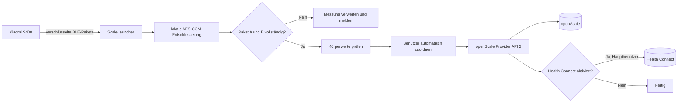
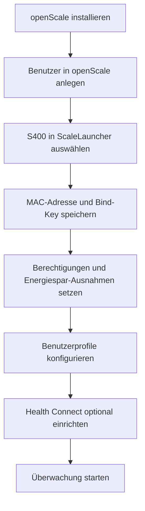
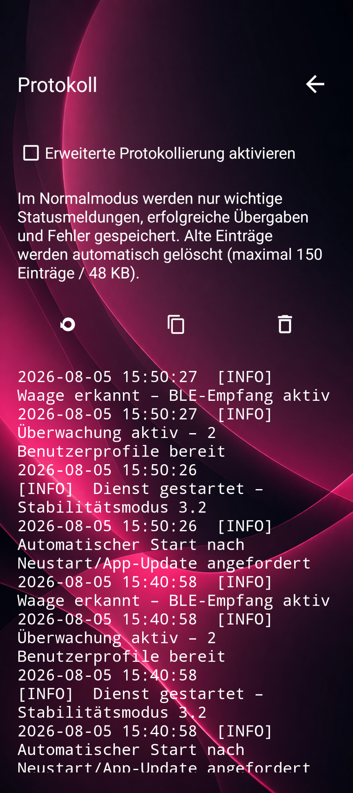

# ScaleLauncher

<p align="center">
  <a href="README.md">English</a> |
  <strong>Deutsch</strong>
</p>

<p align="center">
  <strong>Datenschutzfreundliche Begleit-App für die Xiaomi Body Composition Scale S400, openScale und optional Health Connect.</strong>
</p>

<p align="center">
  
  
  
  
</p>

> **Kurz erklärt:** ScaleLauncher empfängt die verschlüsselten Bluetooth-Messdaten der Xiaomi S400, entschlüsselt und prüft sie lokal, ordnet die Messung einem openScale-Benutzer zu und speichert die vollständigen Werte in openScale. Für einen ausgewählten Hauptbenutzer können Werte zusätzlich direkt an Health Connect übertragen werden.

> **Stand dieser Anleitung: 17. August 2026**

---

## Inhaltsverzeichnis

- [Wozu dient ScaleLauncher?](#wozu-dient-scalelauncher)
- [Wichtige Eigenschaften](#wichtige-eigenschaften)
- [Voraussetzungen](#voraussetzungen)
- [Installation](#installation)
- [Ersteinrichtung](#ersteinrichtung)
- [Tägliche Nutzung](#tägliche-nutzung)
- [Benutzerzuordnung](#benutzerzuordnung)
- [Health Connect](#health-connect)
- [Status und Benachrichtigungen](#status-und-benachrichtigungen)
- [Protokoll und Diagnose](#protokoll-und-diagnose)
- [Fehlerbehebung](#fehlerbehebung)
- [Datenschutz](#datenschutz)
- [Sprachen](#sprachen)
- [Bekannte Einschränkungen](#bekannte-einschränkungen)
- [Projekt selbst bauen](#projekt-selbst-bauen)

---

## Wozu dient ScaleLauncher?

Die Xiaomi Body Composition Scale S400 sendet ihre Messwerte als verschlüsselte Bluetooth-Low-Energy-Pakete. ScaleLauncher verarbeitet diese Pakete direkt auf dem Android-Gerät.

Die App übernimmt dabei folgende Aufgaben:

1. Sie überwacht die ausgewählte S400 im Hintergrund.
2. Sie entschlüsselt die empfangenen BLE-Pakete lokal.
3. Sie akzeptiert eine Messung nur, wenn alle benötigten Pakete vollständig vorliegen.
4. Sie berechnet und prüft die Körperanalysewerte.
5. Sie ordnet die Messung anhand des Gewichts einem openScale-Benutzer zu.
6. Sie schreibt den vollständigen, bestätigten Wertesatz über openScale Provider API 2 in openScale.
7. Optional überträgt sie ausgewählte Werte für einen Hauptbenutzer an Health Connect.
8. Sie informiert über erfolgreiche, fehlgeschlagene oder nicht eindeutig zuordenbare Messungen.



**Es wird keine Xiaomi-Cloud benötigt.** Die Verarbeitung erfolgt lokal auf dem Android-Gerät.

---

## Wichtige Eigenschaften

### Lokale und cloudfreie Verarbeitung

- Keine Anmeldung bei einem Xiaomi-Konto innerhalb von ScaleLauncher
- Keine Xiaomi-Cloud für die tägliche Messung
- Keine Internetberechtigung der App
- Lokale Entschlüsselung der S400-Messpakete
- Direkte Übergabe an openScale auf demselben Gerät

### Zuverlässige Messungen

ScaleLauncher verwendet ein bewusst strenges **Alles-oder-nichts-Prinzip**:

- Paket A muss Gewicht und hohe Impedanz enthalten.
- Paket B muss die niedrige Impedanz enthalten.
- Beide Pakete müssen zu derselben Messung gehören.
- Alle erwarteten Körperanalysewerte müssen gültig sein.
- Unvollständige oder nicht bestätigte Messungen werden nicht als erfolgreich behandelt.
- Wiederholte BLE-Werbepakete derselben Messung werden ignoriert.
- Nach dem Speichern wird geprüft, ob openScale den vollständigen Datensatz übernommen hat.

### Mehrere Benutzer

- openScale-Benutzer werden in ScaleLauncher als Profile geladen.
- Jedes Profil besitzt eigene Werte für Geburtstag, Größe, Geschlecht, Gewicht und Gewichtstoleranz.
- Eindeutige Messungen werden automatisch zugeordnet.
- Nicht eindeutige Messungen können später manuell zugeordnet oder verworfen werden.
- Das hinterlegte Gewicht wird nach einer erfolgreichen Speicherung anhand der neuesten openScale-Messungen aktualisiert.

### Hintergrundüberwachung

- Permanenter Vordergrunddienst mit Statusbenachrichtigung
- Heartbeat zur Erkennung eines nicht mehr reagierenden Dienstes
- Watchdog für echte BLE-Scanfehler oder einen inaktiven Scanner; reine Funkstille löst keinen vorsorglichen Scan-Neustart mehr aus
- Optionaler automatischer Start nach einem Geräte-Neustart oder App-Update

---

## Voraussetzungen

Für die Nutzung werden benötigt:

| Voraussetzung | Hinweis |
|---|---|
| Xiaomi Body Composition Scale S400 | Andere Waagenmodelle werden derzeit nicht unterstützt. |
| Android 12 oder neuer | Die App hat eine Mindestversion von Android 12. |
| openScale | Provider API 2 wird benötigt. Ältere Provider-APIs werden nicht unterstützt. |
| S400-MAC-Adresse | Format: `AA:BB:CC:DD:EE:FF` |
| S400-Bind-Key | 32 hexadezimale Zeichen, zum Beispiel `001122...` |
| Bluetooth | Muss eingeschaltet sein. |
| Benachrichtigungen | Für den Vordergrunddienst und Messergebnisse erforderlich. |
| Health Connect, optional | Direkte Übertragung wird ab Android 14 unterstützt. |

> **Sicherheitshinweis:** Der Bind-Key ermöglicht die Entschlüsselung der Messdaten deiner Waage. Veröffentliche ihn nicht in Screenshots, Fehlerberichten oder GitHub-Issues.

---

## Installation

### Variante 1: APK aus einem GitHub-Release

1. Öffne die Seite [Releases](https://github.com/1260er/ScaleLauncher/releases).
2. Öffne den neuesten stabilen Release.
3. Lade die APK herunter.
4. Erlaube deinem Browser oder Dateimanager bei Bedarf die Installation unbekannter Apps.
5. Installiere die APK.

### Variante 2: Updates mit Obtainium

Mit [Obtainium](https://github.com/ImranR98/Obtainium) kann ScaleLauncher direkt aus den GitHub-Releases installiert und aktualisiert werden.

1. Installiere Obtainium.
2. Füge diese Repository-Adresse hinzu:

   ```text
   https://github.com/1260er/ScaleLauncher
   ```

3. Wähle den stabilen Release-Kanal.
4. Installiere ScaleLauncher über Obtainium.
5. Künftige Releases werden von Obtainium als Update angeboten.

> Beim Wechsel zwischen unterschiedlich signierten Test- und Release-APKs kann einmalig eine Deinstallation erforderlich sein. Dabei werden die lokalen ScaleLauncher-Einstellungen gelöscht.

---

## Ersteinrichtung



### 1. Benutzer zuerst in openScale anlegen

ScaleLauncher erstellt keine eigenständigen openScale-Benutzer. **Jede Person, die die Waage benutzt, muss vorher einen eigenen Benutzer in openScale besitzen.**

Das gilt auch für Personen, die ScaleLauncher selbst normalerweise nicht verwenden. Ist eine Person mit ähnlichem Gewicht nicht bekannt, könnte ihre Messung sonst fälschlich einem bereits eingerichteten Benutzer zugeordnet werden.

Beispiel:

- Benutzer „Alex“ in openScale anlegen
- Benutzer „Sam“ in openScale anlegen
- Danach in ScaleLauncher die Benutzerliste synchronisieren

#### Warum ist das notwendig?

openScale speichert Messungen getrennt nach Benutzer-ID. ScaleLauncher benötigt diese vorhandenen Benutzer-IDs, damit eine Messung korrekt an das passende openScale-Profil übergeben werden kann.

Es ist hilfreich, wenn für jeden Benutzer bereits einige aktuelle Gewichtsmessungen in openScale vorhanden sind. ScaleLauncher kann daraus ein geeignetes aktuelles Gewicht vorschlagen.

### 2. Waage einrichten

Öffne in ScaleLauncher das Menü und wähle **Waage**.

Trage ein:

- **MAC-Adresse der S400**
- **Bind-Key der S400**

Die MAC-Adresse kann über die Gerätesuche ausgewählt werden. Prüfe anschließend, ob tatsächlich die S400 und nicht ein anderes Bluetooth-Gerät ausgewählt wurde.

#### Gültiges Format

```text
MAC-Adresse: AA:BB:CC:DD:EE:FF
Bind-Key:    32 Zeichen aus 0–9 und A–F
```

Speichere die Einstellungen.

> Der Bind-Key muss bereits vorliegen. ScaleLauncher verwendet ihn lokal, lädt ihn jedoch nicht aus der Xiaomi-Cloud.

#### So kommst du an den Bind-Key

> **Stand: 5. August 2026**  
> Die folgende Anleitung verwendet den quelloffenen **Xiaomi Cloud Tokens Extractor**. Das Werkzeug liest die in deinem Xiaomi-Konto gespeicherten BLE-Schlüssel aus und zeigt sie als `BLE KEY` an.

Verwendete Quellen und Werkzeuge:

- [Offizielle Xiaomi-Anleitung zum Koppeln der S400](https://www.mi.com/global/support/faq/details/KA-107891/)
- [Xiaomi Cloud Tokens Extractor auf GitHub](https://github.com/PiotrMachowski/Xiaomi-cloud-tokens-extractor)
- [Neueste Releases des Extractors](https://github.com/PiotrMachowski/Xiaomi-cloud-tokens-extractor/releases/latest)

##### Vorbereitung auf dem Smartphone

1. Installiere **Xiaomi Home** beziehungsweise **Mi Home**.
2. Melde dich mit deinem Xiaomi-Konto an.
3. Prüfe in Xiaomi Home die gewählte Region. Diese Region brauchst du später im Extractor.
4. Wecke die S400 kurz auf, indem du mit einem Fuß auf die Waage steigst.
5. Öffne in Xiaomi Home oben rechts **+ → Gerät hinzufügen**.
6. Wähle **Xiaomi Body Composition Scale S400** und schließe die Kopplung ab.
7. Führe mindestens eine vollständige Messung durch, damit die Waage sicher im Xiaomi-Konto vorhanden ist.
8. Lass die Waage zunächst im Xiaomi-Konto eingebunden.

> Die S400 wird offiziell mit **Xiaomi Home/Mi Home** gekoppelt. Für dieses Verfahren ist nicht Mi Fitness gemeint.

##### Welche Region muss ich wählen?

Der Extractor fragt nach einem Serverkürzel. Typische Beispiele:

| Xiaomi-Home-Region | Eingabe im Extractor |
|---|---|
| Deutschland | `de` |
| China | `cn` |
| USA | `us` |
| Singapur | `sg` |
| Indien | `in` |
| Russland | `ru` |
| Taiwan | `tw` |

Wenn du die Region nicht sicher kennst, drücke bei der Regionsabfrage einfach **Enter**. Der Extractor prüft dann alle unterstützten Regionen. Das dauert länger, ist aber oft die einfachste Lösung.

---

##### Windows: einfachste Methode mit EXE

1. Öffne die Seite [Neuester Release](https://github.com/PiotrMachowski/Xiaomi-cloud-tokens-extractor/releases/latest).
2. Lade die Datei **`token_extractor.exe`** herunter.
3. Starte `token_extractor.exe`.
4. Das Programm fragt:

   ```text
   Please select a way to log in:
   p - using password
   q - using QR code
   p/q:
   ```

5. Gib vorzugsweise **`q`** ein und bestätige mit Enter.
6. Es erscheint ein QR-Code beziehungsweise eine lokale Adresse, häufig:

   ```text
   http://127.0.0.1:31415
   ```

7. Öffne die Adresse im Browser, falls sie nicht automatisch erscheint.
8. Scanne den QR-Code mit dem Smartphone und bestätige die Anmeldung beim Xiaomi-Konto.
9. Gib bei der Serverabfrage deine Region ein, zum Beispiel `de`, oder drücke Enter für alle Regionen.
10. Suche in der Ausgabe nach deiner S400. Der Block sieht ungefähr so aus:

    ```text
    NAME: Xiaomi Body Composition Scale S400
    ID: blt.3.xxxxxxxxxxxxx
    BLE KEY: 00112233445566778899AABBCCDDEEFF
    MAC: AA:BB:CC:DD:EE:FF
    MODEL: yunmai.scales.ms103
    ```

11. Kopiere **nur** den Wert hinter `BLE KEY:` und die angezeigte `MAC:`.
12. Trage beide Werte unter **ScaleLauncher → Waage** ein.

Direkter Download der aktuellen Windows-Datei:

```text
https://github.com/PiotrMachowski/Xiaomi-cloud-tokens-extractor/releases/latest/download/token_extractor.exe
```

> Lade die EXE ausschließlich aus dem offiziellen GitHub-Repository. Falls Windows die Datei blockiert und du ihr nicht vertraust, verwende stattdessen die Python-Methode weiter unten.

##### Windows: Python-Methode als Alternative

Installiere zuerst [Python 3 für Windows](https://www.python.org/downloads/windows/). Öffne danach **PowerShell** und führe aus:

```powershell
New-Item -ItemType Directory -Force "$HOME\XiaomiBindKey"
Set-Location "$HOME\XiaomiBindKey"

Invoke-WebRequest `
  -Uri "https://github.com/PiotrMachowski/Xiaomi-cloud-tokens-extractor/releases/latest/download/token_extractor.zip" `
  -OutFile "token_extractor.zip"

Expand-Archive -Path "token_extractor.zip" -DestinationPath . -Force
Set-Location "token_extractor"

py -3 -m venv .venv
.\.venv\Scripts\python.exe -m pip install --upgrade pip
.\.venv\Scripts\python.exe -m pip install -r requirements.txt
.\.venv\Scripts\python.exe token_extractor.py
```

Danach wieder:

1. `q` für QR-Anmeldung wählen.
2. QR-Code scannen und Xiaomi-Anmeldung bestätigen.
3. Region eingeben oder Enter drücken.
4. Bei der S400 `BLE KEY` und `MAC` kopieren.

---

##### Linux

Für Debian, Ubuntu, Linux Mint und ähnliche Distributionen:

```bash
sudo apt update
sudo apt install -y python3 python3-venv python3-pip curl unzip

mkdir -p ~/XiaomiBindKey
cd ~/XiaomiBindKey

curl -L \
  -o token_extractor.zip \
  https://github.com/PiotrMachowski/Xiaomi-cloud-tokens-extractor/releases/latest/download/token_extractor.zip

unzip -o token_extractor.zip
cd token_extractor

python3 -m venv .venv
source .venv/bin/activate
python -m pip install --upgrade pip
python -m pip install -r requirements.txt
python token_extractor.py
```

Danach:

1. `q` eingeben.
2. Den angezeigten QR-Code scannen oder die angezeigte lokale URL im Browser öffnen.
3. Xiaomi-Anmeldung bestätigen.
4. Region eingeben, zum Beispiel `de`, oder Enter für alle Regionen.
5. Im Geräteblock der S400 `BLE KEY` und `MAC` kopieren.

Der Extractor bietet außerdem ein offizielles Einzeilen-Skript an:

```bash
bash <(curl -L https://github.com/PiotrMachowski/Xiaomi-cloud-tokens-extractor/raw/master/run.sh)
```

Die manuelle Methode oben ist transparenter, weil du die heruntergeladenen Dateien vor dem Start ansehen kannst.

---

##### macOS

Installiere Python 3 entweder von [python.org](https://www.python.org/downloads/macos/) oder mit Homebrew:

```bash
brew install python
```

Öffne danach das **Terminal** und führe aus:

```bash
mkdir -p ~/XiaomiBindKey
cd ~/XiaomiBindKey

curl -L \
  -o token_extractor.zip \
  https://github.com/PiotrMachowski/Xiaomi-cloud-tokens-extractor/releases/latest/download/token_extractor.zip

unzip -o token_extractor.zip
cd token_extractor

python3 -m venv .venv
source .venv/bin/activate
python -m pip install --upgrade pip
python -m pip install -r requirements.txt
python token_extractor.py
```

Danach:

1. `q` für die QR-Anmeldung wählen.
2. QR-Code scannen oder die lokale URL im Browser öffnen.
3. Xiaomi-Anmeldung bestätigen.
4. Region auswählen oder Enter für alle Regionen drücken.
5. Bei der S400 `BLE KEY` und `MAC` kopieren.

---

##### Was genau wird in ScaleLauncher eingetragen?

Beispielausgabe des Extractors:

```text
BLE KEY: 00112233445566778899AABBCCDDEEFF
MAC: AA:BB:CC:DD:EE:FF
```

Eintrag in ScaleLauncher:

```text
Bind-Key: 00112233445566778899AABBCCDDEEFF
MAC:      AA:BB:CC:DD:EE:FF
```

Der Bind-Key besteht aus genau **32 hexadezimalen Zeichen**. Leerzeichen, Doppelpunkte oder den Text `BLE KEY:` nicht mitkopieren.

##### Nach dem Auslesen

1. Speichere Bind-Key und MAC in ScaleLauncher.
2. Beende Xiaomi Home vollständig über **App-Info → Beenden erzwingen**, damit die offizielle App nicht gleichzeitig mit der Waage kommuniziert.
3. Starte in ScaleLauncher die Überwachung.
4. Führe eine neue Messung durch.

Wenn du die Waage später in Xiaomi Home entfernst und erneut hinzufügst, kann ein neuer BLE-Schlüssel erzeugt werden. In diesem Fall musst du den Bind-Key erneut auslesen und in ScaleLauncher ersetzen.

##### Wenn die S400 nicht in der Ausgabe erscheint

- Prüfe, ob du dasselbe Xiaomi-Konto wie in Xiaomi Home verwendest.
- Prüfe die Region oder lass alle Regionen durchsuchen.
- Führe in Xiaomi Home eine vollständige Messung durch und starte den Extractor erneut.
- Verwende bei Login-Problemen `q` statt `p`.
- Prüfe bei E-Mail-2FA auch den Spam-Ordner.
- Deaktiviere vorübergehend VPN, Pi-hole, AdGuard oder restriktive DNS-Filter, falls die Anmeldung fehlschlägt.
- Xiaomi begrenzt die Zahl der 2FA-Anfragen. Nach mehreren Fehlversuchen kann eine Wartezeit nötig sein.

##### Datenschutz und Sicherheit

Der Extractor läuft lokal, meldet sich aber bei Xiaomi-Servern an und kann neben der S400 auch Schlüssel oder Tokens anderer Xiaomi-Geräte anzeigen.

- Nutze nach Möglichkeit die QR-Anmeldung.
- Teile niemals die komplette Terminalausgabe.
- Veröffentliche weder `BLE KEY`, `TOKEN`, Xiaomi-Kontodaten noch vollständige Geräte-IDs.
- Verwende keine unbekannten Online-Webseiten, denen du dein Xiaomi-Passwort direkt übergeben musst.

### 3. Berechtigungen und Systemanforderungen

Öffne **Berechtigungen** und arbeite alle angezeigten Punkte ab.

Erforderlich sind insbesondere:

- Bluetooth-Geräte in der Nähe suchen
- Bluetooth-Verbindungen verwenden
- Benachrichtigungen anzeigen
- ScaleLauncher von der Akkuoptimierung ausnehmen
- „App bei Nichtnutzung verwalten“ deaktivieren

Optional kann der automatische Start aktiviert werden. Dann versucht ScaleLauncher, die Überwachung nach einem Neustart oder App-Update wieder zu starten.

#### Warum sind diese Einstellungen nötig?

Android kann Hintergrunddienste, Bluetooth-Scans oder Benachrichtigungen einschränken. ScaleLauncher startet die Überwachung deshalb nur, wenn die notwendigen Voraussetzungen erfüllt sind. So wird vermieden, dass die App scheinbar läuft, tatsächlich aber keine Messung empfangen kann.

### 4. Benutzerprofile konfigurieren

Öffne **Benutzer**. Die in openScale vorhandenen Benutzer erscheinen in der Liste.

Öffne jeden Benutzer und hinterlege:

| Einstellung | Bedeutung |
|---|---|
| Geburtstag | Wird für die Körperanalyse benötigt. Unterstützt werden Erwachsene von 18 bis 120 Jahren. |
| Größe | Wird für Körperanalyse und BMI benötigt. |
| Geschlecht | Wird bei der Berechnung der Körperanalyse verwendet. |
| Gewicht | Erwartetes aktuelles Gewicht des Benutzers für die Zuordnung. |
| Gewichtstoleranz | Maximal erlaubter Abstand zwischen Messung und hinterlegtem Gewicht. Der Standardwert beträgt 2 kg. |

Speichere jedes Profil einzeln. Die Überwachung kann erst gestartet werden, wenn alle aus openScale geladenen Benutzer vollständig eingerichtet sind.

> Benutzer werden in openScale gelöscht oder umbenannt. ScaleLauncher synchronisiert diese Änderungen und entfernt veraltete Zuordnungen.

### 5. Health Connect optional einrichten

Öffne **Health Connect**.

1. Aktiviere die Übertragung.
2. Wähle genau einen Hauptbenutzer.
3. Wähle die zu übertragenden Werte.
4. Erteile die angeforderten Schreibrechte.
5. Speichere die Einstellungen.

Unterstützte Werte:

- Gewicht
- Körperfett
- Körperwassermasse
- Knochenmasse
- fettfreie Masse
- Grundumsatz
- Gewicht und Größe als Grundlage für die BMI-Berechnung kompatibler Apps

Nur Messungen des ausgewählten Hauptbenutzers werden zusätzlich an Health Connect geschrieben. Messungen anderer Benutzer bleiben ausschließlich in openScale.

### 6. Überwachung starten

Öffne die Startseite und tippe auf **Überwachen** beziehungsweise **Monitor**.

Der Status sollte anschließend unter anderem anzeigen:

- `AKTIV` / `ACTIVE`
- `WARTET` / `WAITING`
- Waage erreichbar
- Zeitpunkt des letzten empfangenen Waagensignals
- `Health-Connect aktiv` oder `Health-Connect deaktiviert`
- ausgewählter Health-Connect-Benutzer

Wenn die Startseite ungefähr so aussieht, ist die Grundkonfiguration meist korrekt:

<p align="center">
  
</p>

Während der Überwachung bleibt eine permanente, leise Android-Benachrichtigung sichtbar. Sie verhindert, dass Android den Dienst wie einen gewöhnlichen Hintergrundprozess beendet.

---

## Tägliche Nutzung

Nach der Ersteinrichtung muss ScaleLauncher normalerweise nicht geöffnet bleiben.

1. Stelle sicher, dass die Überwachung aktiv ist.
2. Steige für eine Körperanalyse barfuß auf die S400.
3. Warte, bis die Waage die Messung beendet hat.
4. ScaleLauncher empfängt beide verschlüsselten Messpakete.
5. Die App prüft die Messung und sucht den passenden Benutzer.
6. Die Messung wird in openScale gespeichert.
7. Optional werden die ausgewählten Werte an Health Connect übertragen.
8. Eine Benachrichtigung zeigt das Ergebnis.

### Erfolgreiche Messung

Bei einer erfolgreichen Messung erscheint eine Benachrichtigung wie:

```text
Messung erfolgreich an Alex zugeordnet
Alle vollständigen Messwerte wurden gespeichert.
```

### Fehlgeschlagene Messung

Wenn ein Paket fehlt, die Entschlüsselung fehlschlägt oder ein Körperwert ungültig ist, wird die Messung vollständig verworfen.

```text
Messung fehlgeschlagen, bitte wiederholen
```

Wiederhole die Messung. Teilwerte werden nicht absichtlich als vollständige Messung gespeichert.

---

## Benutzerzuordnung

ScaleLauncher vergleicht das gemessene Gewicht mit dem hinterlegten Gewicht jedes openScale-Benutzerprofils.

### Beispiel

| Benutzer | Gewicht | Gemessen | Abstand |
|---|---:|---:|---:|
| Alex | 80,0 kg | 79,4 kg | 0,6 kg |
| Sam | 76,5 kg | 79,4 kg | 2,9 kg |

Liegt die Messung innerhalb der eingestellten Toleranz von **genau einem** Benutzer, wird sie automatisch zugeordnet.

Liegt die Messung innerhalb der Toleranz von **mehreren Benutzern**, erfolgt keine automatische Zuordnung – auch dann nicht, wenn ein Profil näher liegt. Der richtige Benutzer muss anschließend manuell ausgewählt werden. Liegt kein Profil innerhalb seiner Toleranz, bleibt die Messung ebenfalls offen.

### Nicht zugeordnete Messung bearbeiten

Auf der Startseite erscheint der Bereich **Nicht zugeordnete Messung** beziehungsweise **Unassigned measurement**.

1. Wähle im Auswahlfeld den richtigen Benutzer.
2. Tippe auf **Zuordnen**.
3. Die Messung wird verarbeitet und in openScale gespeichert.

Alternativ kann die Messung mit **Verwerfen** gelöscht werden.

Nicht zugeordnete Messungen bleiben lokal gespeichert und werden zusätzlich über eine sichtbare Benachrichtigung gemeldet.

---

## Health Connect

Health Connect ist optional und ergänzt openScale. openScale bleibt das primäre Ziel der Messung.

### Wichtige Regeln

- Health Connect benötigt Android 14 oder neuer.
- Es kann genau ein Hauptbenutzer ausgewählt werden.
- Nur Messungen dieses Benutzers werden übertragen.
- Es müssen mindestens ein Wert und die dazugehörigen Schreibrechte ausgewählt sein.
- ScaleLauncher prüft, ob Health Connect dieselbe Anzahl Datensätze bestätigt, die geschrieben werden sollte.
- Schlägt Health Connect fehl, bleibt eine bereits erfolgreich in openScale gespeicherte Messung erhalten.

### App-Sprache in Android auswählen

ScaleLauncher unterstützt Deutsch und Englisch:

1. ScaleLauncher-Symbol lange drücken.
2. **App-Info** öffnen.
3. **Sprache** auswählen.
4. **Deutsch**, **English** oder **Systemstandard** wählen.

Nach einem Sprachwechsel kann ein Neustart der Überwachung nötig sein, damit bereits laufende Dienstmeldungen ebenfalls in der neuen Sprache erscheinen.

Beispiel der Startseite auf Englisch:

<p align="center">
  
</p>

---

## Status und Benachrichtigungen

ScaleLauncher verwendet zwei Benachrichtigungskanäle.

### Waagenüberwachung

Eine permanente, leise Benachrichtigung zeigt den Zustand des Vordergrunddienstes:

- ScaleLauncher aktiv
- ScaleLauncher startet
- ScaleLauncher – Fehler
- Waage erreichbar
- Suche S400-Waage
- BLE-Scan wird neu gestartet

Über die Aktion **Stoppen** kann die Überwachung direkt beendet werden.

### Messergebnisse

Dieser Kanal meldet:

- erfolgreiche Messung
- nicht zugeordnete Messung
- fehlgeschlagene Messung
- unvollständige Übertragung an Health Connect

Ergebnisbenachrichtigungen bleiben sichtbar, bis sie vom Benutzer entfernt oder durch ein neues Ergebnis ersetzt werden.

---

## Protokoll und Diagnose

Unter **Protokoll** können wichtige Ereignisse eingesehen werden.

<p align="center">
  
</p>

### Normalmodus

Enthält unter anderem:

- Start und Ende des Dienstes
- erfolgreiche Benutzerzuordnung
- erfolgreiche Speicherung
- Warnungen
- Fehler

### Diagnosemodus

Der Diagnosemodus ergänzt detailliertere Informationen, zum Beispiel:

- erkannte BLE-Paketmuster
- Kandidaten der Benutzerzuordnung
- berechnete Körperwerte
- openScale-Prüfergebnisse
- Health-Connect-Schreibvorgänge
- angezeigte Toast-Meldungen

Das Protokoll ist als Ringpuffer begrenzt:

- maximal 150 Einträge
- ungefähr 48 KB
- älteste Einträge werden automatisch entfernt

Über die Schaltflächen kann das Protokoll:

- aktualisiert
- kopiert
- gelöscht

werden.

> Aktiviere den Diagnosemodus nur bei der Fehlersuche. Das Protokoll kann Benutzernamen, Gewichte und technische Messdetails enthalten.

---

## Fehlerbehebung

| Problem | Mögliche Ursache | Lösung |
|---|---|---|
| Überwachung startet nicht | Akkuoptimierung noch aktiv | ScaleLauncher von der Akkuoptimierung ausnehmen. |
| Überwachung startet nicht | „App bei Nichtnutzung verwalten“ aktiv | Diese Android-Funktion für ScaleLauncher deaktivieren. |
| Keine permanente Benachrichtigung | Benachrichtigungsrecht fehlt | Benachrichtigungen in der App-Info erlauben. |
| Waage wird nicht gefunden | Bluetooth aus oder falsche MAC-Adresse | Bluetooth einschalten und die S400 erneut auswählen. |
| Waage ist erreichbar, aber es kommt keine Messung an | Die S400 sendet möglicherweise vorübergehend nur BLE-Leerlaufpakete | ScaleLauncher-Überwachung stoppen, in Xiaomi Home eine vollständige Messung durchführen, Xiaomi Home anschließend vollständig schließen und die ScaleLauncher-Überwachung erneut starten. |
| S400-Pakete können nicht entschlüsselt werden | Bind-Key falsch | Den 32-stelligen Bind-Key prüfen. |
| Messung wird immer verworfen | Paket A oder B fehlt | Messung erneut durchführen und Telefon näher an der Waage platzieren. |
| Benutzer wird nicht automatisch erkannt | Gewicht oder Toleranz unpassend | Benutzerprofil prüfen und hinterlegtes Gewicht aktualisieren. |
| Zwei Benutzer werden verwechselt | Hinterlegte Gewichte liegen zu nah beieinander | Engere Toleranzen verwenden; unklare Messungen manuell zuordnen. |
| openScale-Speicherung schlägt fehl | Berechtigung fehlt oder die gespeicherten Werte konnten nicht bestätigt werden | openScale-Zugriff erneut erlauben und das Protokoll prüfen. |
| Health Connect bleibt leer | Kein Hauptbenutzer, keine Werte oder Rechte fehlen | Health-Connect-Seite vollständig konfigurieren. |
| Nach Neustart keine Überwachung | Autostart oder Systemfreigaben fehlen | Automatischen Start aktivieren und Energiespar-Einstellungen prüfen. |
| Status bleibt nach Sprachwechsel in alter Sprache | Dienst lief bereits | Überwachung stoppen und erneut starten. |

### Für einen Fehlerbericht

Füge möglichst folgende Angaben bei:

- Android-Version
- ScaleLauncher-Version
- openScale-Version
- genaue Fehlermeldung
- relevanter Protokollabschnitt
- ob Diagnosemodus aktiv war

Entferne vorher:

- Bind-Key
- vollständige MAC-Adresse, falls du sie nicht veröffentlichen möchtest
- persönliche Namen
- sensible Gesundheits- und Gewichtsdaten

---

## Datenschutz

ScaleLauncher wurde für eine lokale Verarbeitung ohne Xiaomi-Cloud entwickelt.

- Keine Internetberechtigung
- Keine Anmeldung in der App
- Keine Übertragung an einen ScaleLauncher-Server
- Messdaten bleiben auf dem Android-Gerät
- openScale wird lokal über dessen Content Provider angesprochen
- Health Connect wird nur bei ausdrücklicher Aktivierung verwendet
- Der Bind-Key wird lokal in den App-Einstellungen gespeichert

Android-Backups sind für ScaleLauncher deaktiviert. Trotzdem sollte das Gerät durch eine Displaysperre geschützt sein.

---

## Sprachen

Die App enthält:

- Deutsch
- Englisch

Standardmäßig verwendet ScaleLauncher die Systemsprache. Ab Android 13 kann die Sprache unabhängig von der Systemsprache über die App-Info ausgewählt werden.

---

## Bekannte Einschränkungen

- Unterstützt wird derzeit nur die Xiaomi Body Composition Scale S400.
- Android 12 oder neuer ist erforderlich.
- Health Connect wird ab Android 14 unterstützt.
- Für die Körperanalyse werden nur Profile im Alter von 18 bis 120 Jahren akzeptiert.
- Health Connect kann nur für einen Hauptbenutzer aktiviert werden.
- Der S400-Bind-Key muss bereits bekannt sein.
- Unvollständige Messungen werden bewusst vollständig verworfen.
- Die Benutzerzuordnung basiert auf hinterlegtem Gewicht und Toleranz; Benutzer mit sehr ähnlichem Gewicht müssen unter Umständen manuell ausgewählt werden.

---

## Screenshots

Die in dieser README verwendeten Screenshots liegen im Ordner [`docs/images/`](docs/images/).

Verwendet werden hier bewusst Screenshots mit unkritischen Beispieldaten beziehungsweise Vornamen. Sensible Daten wie MAC-Adresse, Bind-Key oder reale Gesundheitswerte sollten in öffentlichen Screenshots weiterhin unkenntlich gemacht werden.

---

## Projekt selbst bauen

### Android Studio

1. Repository klonen:

   ```bash
   git clone https://github.com/1260er/ScaleLauncher.git
   cd ScaleLauncher
   ```

2. Das Projekt in Android Studio öffnen.
3. JDK 17 auswählen.
4. Android SDK 35 installieren.
5. Gradle-Synchronisierung ausführen.
6. Über **Build → Build APK(s)** eine Debug-APK erstellen.

### Kommandozeile

Benötigt werden:

- JDK 17
- Android SDK 35
- Gradle 8.9
- korrekt gesetztes `sdk.dir` in `local.properties`

```properties
sdk.dir=/pfad/zum/Android/Sdk
```

Anschließend:

```bash
gradle assembleDebug
```

Die APK befindet sich danach normalerweise unter:

```text
app/build/outputs/apk/debug/
```

Für einen signierten Release-Build siehe [`RELEASE_SETUP.md`](RELEASE_SETUP.md).

---

## Mitwirken und Fehler melden

Fehlerberichte und Verbesserungsvorschläge können über die [GitHub-Issues](https://github.com/1260er/ScaleLauncher/issues) eingereicht werden.

Bitte niemals einen echten Bind-Key in einem Issue veröffentlichen.

---

## Lizenz

Dieses Projekt steht unter der im Repository enthaltenen [`LICENSE`](LICENSE).

ScaleLauncher ist ein unabhängiges Open-Source-Projekt und steht in keiner Verbindung zu Xiaomi oder den Entwicklern von openScale.
