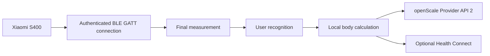

# ScaleLauncher

<p align="center">
  <strong>English</strong> |
  <a href="README.de.md">Deutsch</a>
</p>

<p align="center">
  <strong>Privacy-friendly Android companion for the Xiaomi Body Composition Scale S400, openScale, and optional Health Connect integration.</strong>
</p>

> **In one sentence:** ScaleLauncher connects directly to the Xiaomi S400 over Bluetooth, authenticates with the scale login token, receives complete measurements, recognizes the matching user, and stores locally calculated body values in openScale.

> **Documentation last updated: August 24, 2026**

## What is ScaleLauncher for?

ScaleLauncher connects the **Xiaomi Body Composition Scale S400** directly to **openScale**.

The app can:

- monitor the S400 in the background
- establish an authenticated BLE GATT connection
- receive weight and both impedance values
- recognize users by reference weight and tolerance
- calculate body-composition values locally
- store complete measurements through openScale Provider API 2
- optionally write selected values to Health Connect
- securely connect multiple ScaleLauncher phones in one household

Daily measurements require **no Xiaomi cloud connection and no Internet permission**.

## How it works

ScaleLauncher does not merely scan passive advertisements. It establishes an authenticated **BLE GATT connection**. After login, the S400 provides live weight data followed by a final record containing weight and dual impedance.



## Requirements

| Requirement | Notes |
|---|---|
| Xiaomi Body Composition Scale S400 | Other scale models are not currently supported. |
| Android 12 or newer | Minimum version. |
| openScale | Provider API 2 required. |
| S400 MAC address | Format `AA:BB:CC:DD:EE:FF` |
| S400 login token | Exactly 24 hexadecimal characters |
| Bluetooth | Must be enabled. |
| Notifications | Required for background monitoring and results. |
| Health Connect, optional | Direct writing requires Android 14 or newer. |

### Login token

ScaleLauncher uses the **12-byte login token** of the S400:

```text
MAC:   AA:BB:CC:DD:EE:FF
TOKEN: 00112233445566778899AABB
```

The token contains exactly **24 hexadecimal characters**.

> The former 32-character BLE bind key is not used as the input credential by the current GATT login.

The token can be extracted with suitable Xiaomi token tools after the scale has been added to Xiaomi Home / Mi Home.

Reference:
- https://github.com/PiotrMachowski/Xiaomi-cloud-tokens-extractor

Never publish the token in screenshots, logs, or bug reports.

## Installation

Install an APK from GitHub Releases:

https://github.com/1260er/ScaleLauncher/releases

Or use Obtainium with:

```text
https://github.com/1260er/ScaleLauncher
```

## Initial setup

Recommended order:

1. Install openScale.
2. Create users in openScale.
3. Select the S400 under **Scale**.
4. Save MAC address and login token.
5. Complete **Permissions**.
6. Configure **Users**.
7. Optionally configure Health Connect.
8. Start monitoring.

### Scale

Under **Scale**, save the MAC address and login token.

#### Scale is not found

The S400 effectively supports only **one active authenticated Bluetooth client at a time**.

If it cannot be found:

1. Stop monitoring on another ScaleLauncher phone or briefly disable Bluetooth there.
2. Fully close Xiaomi Home when necessary.
3. Wake the scale by briefly stepping on it.
4. Search again.

### Permissions

Especially important:

- Bluetooth
- notifications
- battery optimization disabled for ScaleLauncher
- unused app management disabled

These settings help prevent Android from stopping long-running monitoring.

## Users and automatic assignment

Each user profile includes information such as:

- date of birth
- height
- sex
- reference weight
- weight tolerance
- destination or owner phone

Automatic recognition primarily uses:

```text
reference weight ± tolerance
```

If exactly one user matches, the measurement can be assigned automatically. If multiple users match, it remains pending for manual assignment. Measurements outside all configured tolerances also remain unassigned.

### Duplicate names

Names are **not identities**. Two users may have the same name.

Every household profile has a unique `householdProfileId`.

```text
Anna → profile ID A
Anna → profile ID B
```

These profiles remain completely separate.

## Multi-user and multiple phones

Under **Users → Multi-user**, multiple ScaleLauncher phones in one household can be securely connected.

The S400 can only be actively used by one phone at a time. That phone is the **collector**. Other phones remain in **standby** and can take over when the scale becomes available.

### Secure pairing

1. Open **Multi-user** on both phones.
2. Start pairing on both devices.
3. The phones perform a local cryptographic key exchange.
4. Both display a six-digit safety code.
5. Confirm only when both codes are identical.

### Which data is shared?

Only household recognition metadata is synchronized:

- unique household profile ID
- name
- owner phone
- reference weight
- tolerance
- active state
- update timestamp

The shared household profile does not include:

- date of birth
- height
- sex
- openScale user ID
- calculated body-composition values

These remain on the owner phone.

### Owner phone

Each user has an owner or destination phone. Body calculation, openScale storage, and optional Health Connect are intended to happen there.

The `householdProfileId` is the identity. Names are never used to merge profiles automatically.

### Current development status

The `ui-v1.2.0` development branch already contains:

- secure BLE pairing
- trusted peers
- encrypted peer communication
- household profile IDs
- profile synchronization
- persistent outbox
- inbox deduplication
- ACK confirmation
- collector/standby foundation

Final automatic measurement routing between owner phones is still being implemented and validated with multiple physical phones before release.

## Health Connect

Health Connect is optional. For the selected user, ScaleLauncher can write values including:

- weight
- body fat
- body water
- bone mass
- lean body mass
- basal metabolic rate
- values required for BMI

ScaleLauncher does not read health records back from Health Connect.

## Daily use

1. Start **Monitor**.
2. ScaleLauncher connects to the S400 or waits in standby.
3. Step on the scale and complete the measurement.
4. ScaleLauncher receives the final record.
5. The user is recognized or the measurement remains pending.
6. Body composition is calculated locally.
7. Complete values are stored in openScale.
8. Selected values can optionally be written to Health Connect.

## Troubleshooting

### Scale is not found

Possible causes:

- another phone already holds the S400 connection
- Xiaomi Home is communicating with the scale
- the scale is asleep
- Bluetooth is disabled
- Bluetooth permission is missing

### Scale authentication fails

Check:

- correct MAC address
- token contains exactly 24 hexadecimal characters
- token belongs to this S400
- the scale was not reset or re-added in Xiaomi Home after extraction

### Monitoring only works after stopping and starting again

Enable diagnostic logging and inspect GATT state, standby state, reconnect attempts, and authentication.

### Measurement is not assigned automatically

Check reference weight and tolerance. If multiple profiles are inside tolerance at the same time, the measurement is intentionally ambiguous.

### openScale does not receive measurements

Check:

- openScale installed
- access granted
- Provider API 2 available
- user exists on this phone
- ScaleLauncher user profile complete

## Privacy

ScaleLauncher is designed for local processing.

- Scale communication happens directly over Bluetooth.
- Normal measurements do not require Xiaomi Cloud.
- ScaleLauncher has no Internet permission.
- Paired ScaleLauncher phones communicate directly over Bluetooth.
- Peer messages are encrypted.
- Personal body profile data and local openScale user IDs remain on the owner phone.
- Only explicitly selected values are written to Health Connect.

## Known limitations

- Xiaomi Body Composition Scale S400 only.
- openScale Provider API 2 is required.
- Direct Health Connect writing requires Android 14 or newer.
- The S400 permits only one active authenticated connection at a time.
- Multi-phone measurement routing is still in final implementation and testing.
- Xiaomi firmware or Mi Home protocol changes may affect compatibility.

## Building the project

Requirements:

- JDK 17
- Android SDK
- Gradle 8.x

Debug build:

```bash
gradle :app:assembleDebug
```

Current Android configuration:

```text
minSdk 31
targetSdk 35
compileSdk 35
```

## License

ScaleLauncher is licensed under **GNU General Public License v3.0 only**.

See [LICENSE](LICENSE).

## Credits

Useful public references:

- https://github.com/nokistin/xiaomi-s400-live
- https://github.com/PiotrMachowski/Xiaomi-cloud-tokens-extractor

ScaleLauncher is an independent project and is not affiliated with Xiaomi or openScale.
