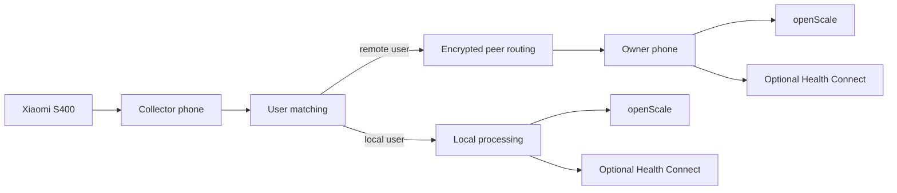

# ScaleLauncher

<p align="center">
  <strong>English</strong> |
  <a href="README.de.md">Deutsch</a>
</p>

<p align="center">
  <strong>Privacy-friendly Android companion for the Xiaomi Body Composition Scale S400, openScale, and optional Health Connect.</strong>
</p>

> **In short:** ScaleLauncher connects to the Xiaomi S400 through authenticated BLE GATT and receives complete measurements. In a household with multiple ScaleLauncher phones, one device at a time acts as the **collector** and holds the scale connection. If the measurement belongs to a user on another phone, it is encrypted and forwarded to that user's **owner phone**, where body values are calculated and stored in openScale and optionally Health Connect.

> **Documentation status: September 11, 2026**

## Status

**ScaleLauncher 1.6.0** is the current published stable release.

Version 1.6.0 completed full technical review and practical final acceptance on September 11, 2026. The stable release is published as tag `v1.6.0`.

For 1.6.0, durable Room storage of critical state, openScale write safety, recovery after process and Bluetooth interruptions, and peer communication have been further hardened. The openScale integration requires **Provider API 3**.

The monitoring notification also reflects the current collector and scale reachability status.

The full regression test and final acceptance result are documented in [TESTPLAN.md](TESTPLAN.md).

## What ScaleLauncher does

ScaleLauncher connects the **Xiaomi Body Composition Scale S400** directly to **openScale**.

It can:

- monitor the S400 in the background
- establish an authenticated BLE GATT connection
- receive weight and both impedance values
- recognize users by reference weight and tolerance
- keep ambiguous or unmatched measurements pending for a human decision
- calculate body-composition values locally on the owning phone
- store complete measurements through openScale Provider API 3
- optionally write selected values to Health Connect
- securely connect multiple ScaleLauncher phones in one household
- route measurements to the correct owner phone even when another phone is the collector

### Measurement data from the S400

Measurements are **not assembled from BLE advertising packets** and do not use a “Packet A/Packet B” pair.

After establishing the BLE GATT connection, ScaleLauncher authenticates with the scale's 12-byte login token. The S400 then sends encrypted CMTP data which can technically span multiple GATT frames. ScaleLauncher assembles the complete frame sequence, decrypts it, and processes either LIVE data or the final measurement record.

The final measurement provides the weight and both impedance values used for further processing.

Daily measurements require **no Xiaomi cloud connection and no Internet permission**.

## How it works

The S400 allows only one active authenticated Bluetooth client at a time. ScaleLauncher therefore separates the phone currently connected to the scale from the phone that owns a user's data.



The **collector** is simply the phone that currently holds the S400 connection. It is not a permanent main device. Another paired phone can take over when Bluetooth or availability changes.

## Requirements

| Requirement | Notes |
|---|---|
| Xiaomi Body Composition Scale S400 | Practically tested with `yunmai.scales.ms104`. |
| Android 12 or newer | `minSdk 31` |
| openScale | Provider API 3 required |
| S400 MAC address | Format `AA:BB:CC:DD:EE:FF` |
| S400 login token | Exactly 24 hexadecimal characters |
| Bluetooth | Required |
| Notifications | Required for background monitoring and assignment notifications |
| Health Connect, optional | Direct writing requires Android 14 or newer |

### Other Xiaomi scales

The currently verified model is the **Xiaomi Body Composition Scale S400 `yunmai.scales.ms104`**.

Closely related S400 variants may be compatible if they use the same authenticated GATT protocol, but they are not currently guaranteed. Older Xiaomi scales such as the Mi Body Composition Scale 2 use a different Bluetooth architecture and are not automatically compatible.

## Login token

ScaleLauncher uses the **12-byte S400 login token**:

```text
MAC:   AA:BB:CC:DD:EE:FF
TOKEN: 00112233445566778899AABB
```

The token contains exactly **24 hexadecimal characters**.

The current setup requires only the MAC address and the 24-character login token.

A token can be extracted after adding the scale to Xiaomi Home / Mi Home with a suitable Xiaomi token tool, for example:

- https://github.com/PiotrMachowski/Xiaomi-cloud-tokens-extractor

Never publish the token in screenshots, logs, or bug reports.

## Important: do not use Xiaomi Home in parallel

The S400 can maintain only **one active Bluetooth connection at a time**.

Recommended setup:

1. Add the S400 to Xiaomi Home / Mi Home initially.
2. Extract MAC address and login token.
3. Save both values in ScaleLauncher.
4. Remove the S400 from Xiaomi Home using **Delete device**.
5. **Do not factory-reset the scale.**
6. Use ScaleLauncher for ongoing monitoring.

A factory reset or adding the scale to Xiaomi Home again may create a new token.

## Installation

Stable developer-signed APKs are published through GitHub Releases:

https://github.com/1260er/ScaleLauncher/releases

ScaleLauncher also contains the metadata and source-build support required for distribution through F-Droid. Availability there may follow a GitHub release later because repository inclusion and update processing are handled independently.

The GitHub repository can also be tracked with Obtainium:

```text
https://github.com/1260er/ScaleLauncher
```

## Initial setup

1. Install openScale and create the users whose measurements should be stored locally on this phone.
2. **Do not pair the S400 as a Bluetooth scale in openScale.**
3. Add the S400 to Xiaomi Home temporarily.
4. Extract its MAC address and login token.
5. Remove the scale from Xiaomi Home without resetting it.
6. Save MAC address and login token under **Scale**.
7. Complete **Permissions**.
8. Configure every local user under **Users**.
9. Pair additional ScaleLauncher phones under **Users → Multi-user** when needed.
10. Optionally configure Health Connect.
11. Start monitoring.

## openScale integration

ScaleLauncher owns the Bluetooth connection to the S400. openScale is used as the local measurement database through **Provider API 3**. ScaleLauncher 1.6.0 accepts Provider API 3 only; Provider API 2 is deliberately rejected.

Therefore:

- create the desired users in openScale
- grant ScaleLauncher access
- do not connect openScale itself to the S400 over Bluetooth

A second Bluetooth client would compete with ScaleLauncher's exclusive S400 connection.

## User matching

Each ScaleLauncher user profile contains the data required for local processing and matching, including:

- date of birth
- height
- sex
- reference weight
- weight tolerance

Automatic recognition primarily uses:

```text
reference weight ± tolerance
```

If exactly one valid household profile matches, ScaleLauncher can route the measurement automatically.

If multiple profiles match, the measurement remains pending for a decision.

If no profile matches, the measurement remains unassigned and can be handled manually.

Weight matching limits **automatic matching only**. When a human decision is required, the collector can manually assign a pending measurement to another valid local user even if that user was outside the automatic weight candidates.

## Multi-user and multiple phones

### Owner phone and collector

Every user belongs to an **owner phone**. That phone keeps personal body data and is responsible for:

- body-composition calculation
- openScale storage
- optional Health Connect writing

The phone currently connected to the S400 is the **collector**.

The collector may be any paired ScaleLauncher phone. The role can change automatically and does not change user ownership.

### Pair every participating phone directly

For reliable operation, all participating ScaleLauncher phones should be directly paired with each other.

For three phones:

```text
Phone A ↔ Phone B
Phone A ↔ Phone C
Phone B ↔ Phone C
```

Any phone may become the collector and must therefore be able to reach every possible owner phone.

### Secure pairing

1. Open **Users → Multi-user** on both phones.
2. Start pairing on both devices.
3. ScaleLauncher performs a local cryptographic key exchange.
4. Both phones show a six-digit safety code.
5. Confirm only when both codes are identical.

### Shared household data

Only recognition metadata is synchronized between paired phones:

- unique household profile ID
- name
- owner phone
- reference weight
- tolerance
- active state
- update timestamp

Personal profile data such as birth date, height, sex, local openScale user ID, and calculated body-composition values remains on the owner phone.

### Reliable delivery

Peer routing uses:

- persistent Room-based outbox storage
- retry after temporary Bluetooth loss
- faster retry when an ACK is missing
- receiver-side deduplication
- ACK confirmation before final completion
- durable CLOSED completion before removing local pending measurements
- self-healing peer advertising and presence monitoring

This prevents a temporary radio outage from losing a decision or creating duplicate openScale entries.

## Notifications

ScaleLauncher can notify participating phones about an unassigned measurement even when the activity is not open in the foreground.

Background monitoring must remain enabled and Android notification permission must be granted.

The persistent monitoring notification reflects the current collector and scale reachability status. The small status-bar icon may still be rendered monochrome depending on Android or the device manufacturer.

## Health Connect

Health Connect is optional. For the selected local user, ScaleLauncher can write selected supported values such as:

- weight
- body fat
- body water
- bone mass
- lean body mass
- basal metabolic rate
- values required for BMI

ScaleLauncher does not read health records back from Health Connect.

## Daily use

1. Start **Monitor** on the participating phones.
2. One phone becomes collector; the others remain available as peers.
3. Step on the S400 and complete the measurement.
4. ScaleLauncher receives the final record.
5. The user is recognized automatically or the measurement remains pending.
6. If necessary, make the assignment on one of the notified devices.
7. The owner phone calculates the body values.
8. The measurement is stored once in openScale.
9. Selected values can optionally be written to Health Connect.

No permanently designated main phone is required.

## Troubleshooting

### Scale is not found

Check whether:

- another phone already holds the S400 connection
- Xiaomi Home is still communicating with the scale
- openScale itself was paired with the S400
- Bluetooth is disabled
- required Bluetooth permissions are missing
- the scale is asleep

Wake the scale briefly and try again.

### Authentication fails

Check:

- the MAC address
- the 24-character login token
- that the token belongs to this S400
- whether the scale was reset or re-added to Xiaomi Home after token extraction

### Monitoring works only after stop/start

This should not be required in the accepted technical state. Enable diagnostic logging and inspect GATT connection setup, authentication, CMTP reception, collector/standby, and peer transport messages.

### A remote assignment is delayed

Temporary Bluetooth loss can delay delivery. ScaleLauncher keeps pending peer messages persistently and retries after connectivity returns. The assignment may briefly show a completion state until the remote ACK is received.

### openScale does not receive a measurement

Check:

- openScale is installed
- ScaleLauncher has provider access
- Provider API 3 is available
- the destination user exists on that owner phone
- the local ScaleLauncher user profile is complete

## Privacy

ScaleLauncher is designed for local processing.

- Scale communication happens directly over Bluetooth.
- Normal measurements do not require Xiaomi Cloud.
- ScaleLauncher has no Internet permission.
- Paired ScaleLauncher phones communicate directly over Bluetooth.
- Peer messages are encrypted.
- Personal body profile data and local openScale user IDs remain on the owner phone.
- Only explicitly selected values are written to Health Connect.

Detailed privacy information is available in [PRIVACY.md](PRIVACY.md). Asset licensing is documented in [ASSETS.md](ASSETS.md).

## Tested technical baseline

Practical acceptance is documented in [TESTPLAN.md](TESTPLAN.md).

Existing practical regression baseline:

```text
Dev build: dev-262
Branch: ui-v1.5.0
Technical acceptance commit: a97e872
Acceptance date: 2026-09-02
```

This entry remains as the historical practically tested baseline.

**ScaleLauncher 1.6.0 is currently a release candidate and has not yet received final acceptance.** The full 1.6.0 review will be followed by practical final acceptance. The final acceptance build and commit will then be recorded here.

## Building

Requirements:

- JDK 21
- Android SDK
- project-provided Gradle Wrapper
- Java source/target level 17

Automated tests and debug build:

```bash
./gradlew testDebugUnitTest assembleDebug
```

Release Java compilation:

```bash
./gradlew compileReleaseJavaWithJavac
```

Release/source build:

```bash
./gradlew --no-daemon clean testDebugUnitTest assembleRelease
```

The release source build does not require the private ScaleLauncher signing key. This allows F-Droid to build the APK independently from source.

The official GitHub workflow for stable releases requires the private, permanently used release signing data before it can produce a signed APK.

Current Android configuration of the 1.6.0 branch:

```text
minSdk 31
targetSdk 35
compileSdk 35
Java source 17
Java target 17
Build-JDK 21
versionCode 8
versionName 1.6.0
```

## License

ScaleLauncher is licensed under **GNU General Public License v3.0 only**.

See [LICENSE](LICENSE).

## Credits

Useful public references:

- https://github.com/nokistin/xiaomi-s400-live
- https://github.com/PiotrMachowski/Xiaomi-cloud-tokens-extractor

ScaleLauncher is an independent project and is not affiliated with Xiaomi or openScale.
