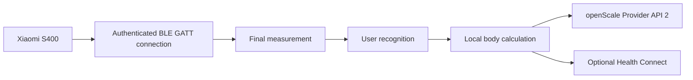

# ScaleLauncher

<p align="center">
  <strong>English</strong> |
  <a href="README.de.md">Deutsch</a>
</p>

<p align="center">
  <strong>Privacy-friendly Android companion for the Xiaomi Body Composition Scale S400, openScale, and optional Health Connect integration.</strong>
</p>

> **In one sentence:** ScaleLauncher connects directly to the Xiaomi S400 over Bluetooth, authenticates with the scale login token, receives complete measurements, recognizes the matching user, and stores locally calculated body values in openScale.

> **Documentation last updated: August 24, 2026**

## What is ScaleLauncher for?

ScaleLauncher connects the **Xiaomi Body Composition Scale S400** directly to **openScale**.

The app can:

- monitor the S400 in the background
- establish an authenticated BLE GATT connection
- receive weight and both impedance values
- recognize users by reference weight and tolerance
- calculate body-composition values locally
- store complete measurements through openScale Provider API 2
- optionally write selected values to Health Connect
- securely connect multiple ScaleLauncher phones in one household

Daily measurements require **no Xiaomi cloud connection and no Internet permission**.

## How it works

ScaleLauncher does not merely scan passive advertisements. It establishes an authenticated **BLE GATT connection**. After login, the S400 provides live weight data followed by a final record containing weight and dual impedance.



## Requirements

| Requirement | Notes |
|---|---|
| Xiaomi Body Composition Scale S400 | Tested with `yunmai.scales.ms104`. Other S400 variants may be compatible but have not been tested. |
| Android 12 or newer | Minimum version. |
| openScale | Provider API 2 required. |
| S400 MAC address | Format `AA:BB:CC:DD:EE:FF` |
| S400 login token | Exactly 24 hexadecimal characters |
| Bluetooth | Must be enabled. |
| Notifications | Required for background monitoring and results. |
| Health Connect, optional | Direct writing requires Android 14 or newer. |

### Other Xiaomi body scales

ScaleLauncher is currently tested in practice with the **Xiaomi Body Composition Scale S400 `yunmai.scales.ms104`**.

Closely related models include:

- S400 `yunmai.scales.ms103`
- S400 Blue `yunmai.scales.ms107`
- S400 Pro `xiaomi.scales.ms110`

These models also provide weight plus low- and high-frequency impedance and belong to the newer Xiaomi S400 family. They **may** therefore work with ScaleLauncher if their GATT authentication and encrypted data channels are identical.

They have **not been tested with ScaleLauncher and are not currently guaranteed to be compatible**.

Older models such as the **Mi Body Composition Scale 2** use a different Bluetooth architecture based on passive BLE advertisements and are therefore not automatically compatible with the current ScaleLauncher S400 GATT implementation.

### Login token

ScaleLauncher uses the **12-byte login token** of the S400:

```text
MAC:   AA:BB:CC:DD:EE:FF
TOKEN: 00112233445566778899AABB
```

The token contains exactly **24 hexadecimal characters**.

> The former 32-character BLE bind key is not used as the input credential by the current GATT login.

The token can be extracted with suitable Xiaomi token tools after the scale has been added to Xiaomi Home / Mi Home.

Reference:
- https://github.com/PiotrMachowski/Xiaomi-cloud-tokens-extractor

Never publish the token in screenshots, logs, or bug reports.

### Important: do not use Xiaomi Home in parallel afterwards

The S400 can maintain only **one active Bluetooth connection at a time**. Xiaomi Home and ScaleLauncher therefore cannot reliably use the scale simultaneously.

Recommended ScaleLauncher setup:

1. Initially add the S400 to Xiaomi Home / Mi Home.
2. Extract the MAC address and login token.
3. Save the MAC address and token in ScaleLauncher.
4. Afterwards remove the S400 from Xiaomi Home using **Delete device**.
5. **Do not factory-reset the scale** when doing this.
6. From then on, monitor the scale through ScaleLauncher.

A factory reset or adding the scale to Xiaomi Home again may generate a new login token. If that happens, extract the current token again and update ScaleLauncher.


## Installation

Install an APK from GitHub Releases:

https://github.com/1260er/ScaleLauncher/releases

Or use Obtainium with:

```text
https://github.com/1260er/ScaleLauncher
```

## Initial setup

Recommended order:

1. Install openScale and create the user or users whose measurements should be managed locally on this phone. Normally, each user uses their own phone.
2. **Do not pair the S400 as a Bluetooth scale in openScale.**
3. Temporarily add the S400 to Xiaomi Home.
4. Extract its MAC address and login token.
5. Remove the S400 from Xiaomi Home afterwards, but **do not reset it**.
6. Save the MAC address and login token under **Scale**.
7. Complete **Permissions**.
8. Configure **Users**.
9. Optionally configure Health Connect.
10. Start monitoring.

### openScale

When used with ScaleLauncher, openScale is **not connected directly to the S400 over Bluetooth**.

ScaleLauncher owns the Bluetooth connection and then writes the completed measurement to the correct local openScale user through **openScale Provider API 2**.

Therefore:

- create the users in openScale
- grant ScaleLauncher access to openScale
- **do not additionally connect the S400 as a scale inside openScale**

An additional Bluetooth connection from openScale would compete with the exclusive S400 connection used by ScaleLauncher.

### Scale

Under **Scale**, save the MAC address and login token.

#### Scale is not found

The S400 effectively supports only **one active authenticated Bluetooth client at a time**.

If it cannot be found:

1. Check whether another ScaleLauncher phone is already using the scale.
2. Check whether the S400 is still active in Xiaomi Home. For ScaleLauncher it should be removed there after extracting the token.
3. Check whether openScale itself was paired with the S400. That pairing is not required for ScaleLauncher and should be removed.
4. Briefly disable Bluetooth on another phone when necessary.
5. Wake the scale by briefly stepping on it.
6. Search again.

### Permissions

Especially important:

- Bluetooth
- notifications
- battery optimization disabled for ScaleLauncher
- unused app management disabled

These settings help prevent Android from stopping long-running monitoring.

## Users and automatic assignment

Each user profile includes information such as:

- date of birth
- height
- sex
- reference weight
- weight tolerance
- destination or owner phone

Automatic recognition primarily uses:

```text
reference weight ± tolerance
```

If exactly one user matches, the measurement can be assigned automatically. If multiple users match, it remains pending for manual assignment. Measurements outside all configured tolerances also remain unassigned.

### Duplicate names

Names are **not identities**. Two users may have the same name.

Every household profile has a unique `householdProfileId`.

```text
Anna → profile ID A
Anna → profile ID B
```

These profiles remain completely separate.

## Multi-user and multiple phones

Under **Users → Multi-user**, the ScaleLauncher phones in a household can be connected into one shared network.

### Why is multi-user mode needed?

The S400 allows only **one active authenticated Bluetooth connection at a time**.

Therefore only one ScaleLauncher phone can communicate directly with the scale. This phone becomes the **collector** and receives the complete measurement.

Multi-user mode separates the current scale connection from the phone that owns the measurement:

1. Any ScaleLauncher phone in the household can become the collector.
2. The collector receives the complete measurement.
3. The synchronized household profiles are used to determine which user may match.
4. The measurement is forwarded securely to the matching user's owner phone.
5. Personal body data is used and body composition is calculated only on that owner phone.
6. The measurement is then stored in openScale and optionally Health Connect on that phone.

This allows every household member to use the shared scale **regardless of which ScaleLauncher phone currently holds the exclusive S400 connection**.

For a unique user match, only that user's owner phone needs to receive the measurement.

If multiple users are possible because their weight tolerances overlap, the collector must be able to reach every relevant owner phone so the assignment can be completed correctly.

### Every phone must be paired with every other phone

For reliable multi-user operation, **all participating ScaleLauncher phones must be directly paired with each other**.

Connecting them only as a chain is not sufficient.

Example with three phones:

```text
Phone A ↔ Phone B
Phone A ↔ Phone C
Phone B ↔ Phone C
```

The reason is the collector role:

**Any phone may become the collector and must then be able to directly reach every possible owner phone.**

There is therefore no permanently designated main phone or collector.

Pairing always takes place between two phones. With more than two devices, repeat the pairing process until every phone is paired with every other phone.

### Collector and standby

Only one phone can actively use the S400 at a time. That phone is the **collector**.

All other ScaleLauncher phones remain in **standby**.

When the scale becomes available or the previous collector is no longer available, another phone can take over.

Which phone currently acts as collector is not important for user assignment. What matters is that the collector can directly reach every possible owner phone.

### Secure pairing

For every phone pair that has not yet been connected:

1. Open **Users → Multi-user** on both devices.
2. Start pairing on both devices.
3. The devices perform a local cryptographic key exchange.
4. Both devices display a six-digit safety code.
5. Confirm only when both codes are identical.
6. Repeat this process for the remaining phone pairs.

### Which data is shared?

Only household recognition metadata is synchronized:

- unique household profile ID
- name
- owner phone
- reference weight
- tolerance
- active state
- update timestamp

The shared household profile does not include:

- date of birth
- height
- sex
- openScale user ID
- calculated body-composition values

These personal values remain on the owner phone.

### Owner phone

Every user has an **owner phone**.

That phone holds the personal profile data and is responsible for:

- calculating body composition
- storing the measurement in openScale
- optionally writing values to Health Connect

The `householdProfileId` is the unique identity of a user inside the household network. Names are never used to automatically merge profiles.

### Current development status

The `ui-v1.2.0` development branch already contains:

- secure BLE pairing
- multiple trusted peers
- encrypted peer communication
- household profile IDs
- profile synchronization
- persistent outbox
- inbox deduplication
- ACK confirmation
- collector/standby foundation

Final automatic measurement forwarding and assignment between owner phones is still being implemented and will be validated with multiple physical phones before release.

## Health Connect

Health Connect is optional. For the selected user, ScaleLauncher can write values including:

- weight
- body fat
- body water
- bone mass
- lean body mass
- basal metabolic rate
- values required for BMI

ScaleLauncher does not read health records back from Health Connect.

## Daily use

1. Start **Monitor**.
2. ScaleLauncher connects to the S400 or waits in standby.
3. Step on the scale and complete the measurement.
4. ScaleLauncher receives the final record.
5. The user is recognized or the measurement remains pending.
6. Body composition is calculated locally.
7. Complete values are stored in openScale.
8. Selected values can optionally be written to Health Connect.

## Troubleshooting

### Scale is not found

Possible causes:

- another phone already holds the S400 connection
- Xiaomi Home is communicating with the scale
- the scale is asleep
- Bluetooth is disabled
- Bluetooth permission is missing

### Scale authentication fails

Check:

- correct MAC address
- token contains exactly 24 hexadecimal characters
- token belongs to this S400
- the scale was not reset or re-added in Xiaomi Home after extraction

### Monitoring only works after stopping and starting again

Enable diagnostic logging and inspect GATT state, standby state, reconnect attempts, and authentication.

### Measurement is not assigned automatically

Check reference weight and tolerance. If multiple profiles are inside tolerance at the same time, the measurement is intentionally ambiguous.

### openScale does not receive measurements

Check:

- openScale installed
- access granted
- Provider API 2 available
- user exists on this phone
- ScaleLauncher user profile complete

## Privacy

ScaleLauncher is designed for local processing.

- Scale communication happens directly over Bluetooth.
- Normal measurements do not require Xiaomi Cloud.
- ScaleLauncher has no Internet permission.
- Paired ScaleLauncher phones communicate directly over Bluetooth.
- Peer messages are encrypted.
- Personal body profile data and local openScale user IDs remain on the owner phone.
- Only explicitly selected values are written to Health Connect.

## Known limitations

- The currently verified model is Xiaomi Body Composition Scale S400 `yunmai.scales.ms104`.
- S400 `ms103`, S400 Blue `ms107`, and S400 Pro `ms110` may work because of their similar architecture, but have not yet been tested with ScaleLauncher.
- Older Xiaomi scales such as Mi Body Composition Scale 2 use a different Bluetooth protocol and are not automatically compatible.
- openScale Provider API 2 is required.
- Direct Health Connect writing requires Android 14 or newer.
- The S400 permits only one active authenticated connection at a time.
- Multi-phone measurement routing is still in final implementation and testing.
- Xiaomi firmware or Mi Home protocol changes may affect compatibility.

## Building the project

Requirements:

- JDK 17
- Android SDK
- Gradle 8.x

Debug build:

```bash
gradle :app:assembleDebug
```

Current Android configuration:

```text
minSdk 31
targetSdk 35
compileSdk 35
```

## License

ScaleLauncher is licensed under **GNU General Public License v3.0 only**.

See [LICENSE](LICENSE).

## Credits

Useful public references:

- https://github.com/nokistin/xiaomi-s400-live
- https://github.com/PiotrMachowski/Xiaomi-cloud-tokens-extractor

ScaleLauncher is an independent project and is not affiliated with Xiaomi or openScale.
