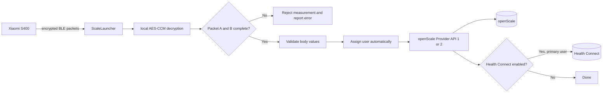
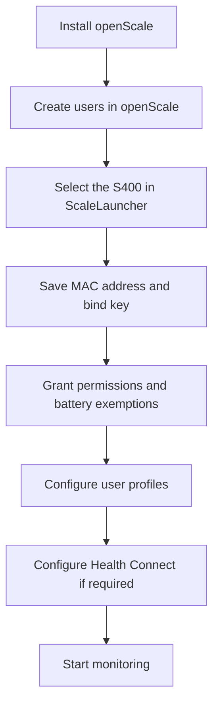
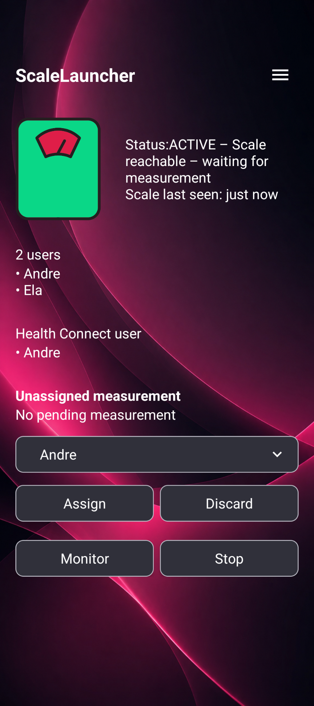
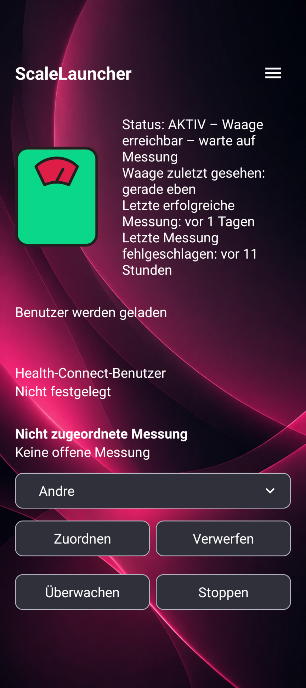
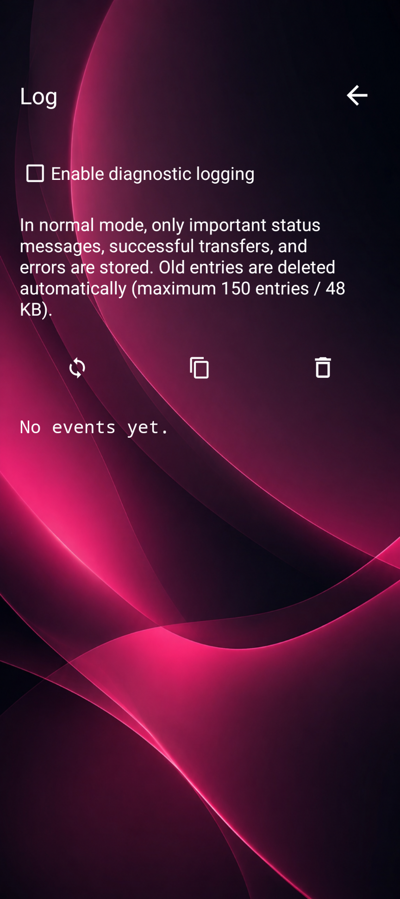

# ScaleLauncher

<p align="center">
  <strong>English</strong> |
  <a href="README.de.md">Deutsch</a>
</p>

<p align="center">
  <strong>Privacy-friendly companion app for the Xiaomi Body Composition Scale S400, openScale, and optional Health Connect integration.</strong>
</p>

<p align="center">
  
  
  
  
</p>

> **In one sentence:** ScaleLauncher receives the encrypted Bluetooth data sent by the Xiaomi S400, decrypts and validates it locally, assigns the measurement to an openScale user, and stores the complete measurement in openScale. Selected values for one primary user can optionally also be written to Health Connect.

> **Documentation last updated: August 8, 2026**

---

## Table of contents

- [What is ScaleLauncher for?](#what-is-scalelauncher-for)
- [Key features](#key-features)
- [Requirements](#requirements)
- [Installation](#installation)
- [Initial setup](#initial-setup)
- [Daily use](#daily-use)
- [User assignment](#user-assignment)
- [Health Connect](#health-connect)
- [Status and notifications](#status-and-notifications)
- [Log and diagnostics](#log-and-diagnostics)
- [Troubleshooting](#troubleshooting)
- [Privacy](#privacy)
- [Languages](#languages)
- [Known limitations](#known-limitations)
- [Building the project](#building-the-project)

---

## What is ScaleLauncher for?

The Xiaomi Body Composition Scale S400 broadcasts its measurement data as encrypted Bluetooth Low Energy packets. ScaleLauncher processes those packets directly on the Android device.

The app performs the following tasks:

1. Monitors the selected S400 in the background.
2. Decrypts the received BLE packets locally.
3. Accepts a measurement only when all required packets are complete.
4. Calculates and validates the body-composition values.
5. Assigns the measurement to an openScale user based on weight.
6. Writes the verified values to openScale. Provider API 1 stores weight, body fat, body water and muscle percentage; Provider API 2 additionally stores the complete value set.
7. Optionally writes selected values for one primary user to Health Connect.
8. Reports successful, failed, or ambiguous measurements.



**The Xiaomi cloud is not required for normal daily operation.** Measurement processing takes place locally on the Android device.

---

## Key features

### Local and cloud-free daily processing

- No Xiaomi account login inside ScaleLauncher
- No Xiaomi cloud required for daily weighing
- No internet permission in the app
- Local decryption of S400 measurement packets
- Direct transfer to openScale on the same Android device

### Reliable measurements

ScaleLauncher deliberately follows an **all-or-nothing** approach:

- Packet A must contain weight and high-frequency impedance.
- Packet B must contain low-frequency impedance.
- Both packets must belong to the same measurement session.
- All expected body-composition values must be valid.
- Incomplete or unconfirmed measurements are not reported as successful.
- Repeated BLE advertisements belonging to the same measurement are ignored.
- After insertion, ScaleLauncher checks that openScale stored the complete data set.

### Multiple users

- openScale users are loaded into ScaleLauncher as profiles.
- Every profile has its own birth date, height, sex, weight, and weight tolerance.
- Clear matches are assigned automatically.
- Ambiguous measurements can be assigned manually or discarded later.
- After a successful insertion, the stored weight can be updated from recent openScale measurements.

### Background monitoring

- Persistent foreground service with a status notification
- Heartbeat to detect an unresponsive service
- Watchdog that restarts a stalled BLE scan
- Optional automatic restart after a device reboot or app update

---

## Requirements

| Requirement | Notes |
|---|---|
| Xiaomi Body Composition Scale S400 | Other scale models are not currently supported. |
| Android 12 or newer | ScaleLauncher currently uses Android 12 as its minimum version. |
| openScale | Provider API 1 is sufficient for the four basic values. Provider API 2 is recommended for the complete value set. |
| S400 MAC address | Format: `AA:BB:CC:DD:EE:FF` |
| S400 bind key | 32 hexadecimal characters, for example `001122...` |
| Bluetooth | Must be enabled. |
| Notifications | Required for the foreground service and measurement results. |
| Health Connect, optional | Direct writing is supported on Android 14 and newer. |

> **Security warning:** The bind key decrypts your scale's measurement data. Never publish it in screenshots, logs, bug reports, or GitHub issues.

---

## Installation

### Option 1: Install an APK from GitHub Releases

1. Open the [Releases](https://github.com/1260er/ScaleLauncher/releases) page.
2. Open the latest stable release.
3. Download the APK.
4. If required, allow your browser or file manager to install unknown apps.
5. Install the APK.

### Option 2: Install and update with Obtainium

[Obtainium](https://github.com/ImranR98/Obtainium) can install and update ScaleLauncher directly from GitHub Releases.

1. Install Obtainium.
2. Add this repository URL:

   ```text
   https://github.com/1260er/ScaleLauncher
   ```

3. Select the stable release channel.
4. Install ScaleLauncher through Obtainium.
5. Future releases will appear as updates in Obtainium.

> Switching between differently signed test and release APKs may require one uninstall. Uninstalling removes the local ScaleLauncher settings.

---

## Initial setup



### 1. Create the users in openScale first

ScaleLauncher does not create independent openScale users. **Every person who uses the scale must first have their own user account in openScale.**

This is required even when a person does not normally use the ScaleLauncher app themselves. If an unknown person has a similar weight to a configured user, their measurement could otherwise be assigned to that user.

Example:

- Create user “Alex” in openScale.
- Create user “Sam” in openScale.
- Then synchronize the user list in ScaleLauncher.

#### Why is this required?

openScale stores measurements under internal user IDs. ScaleLauncher needs those existing IDs to insert a measurement into the correct openScale profile.

It is useful to have a few recent weight measurements for each user in openScale. ScaleLauncher can use them to suggest the current weight.

### 2. Configure the scale

Open the ScaleLauncher menu and select **Scale**.

Enter:

- the **S400 MAC address**
- the **S400 bind key**

The MAC address can be selected through the device scan. Verify that the selected device is the S400 and not another nearby Bluetooth device.

#### Required format

```text
MAC address: AA:BB:CC:DD:EE:FF
Bind key:    32 characters from 0-9 and A-F
```

Save the settings.

> The bind key must already be available. ScaleLauncher uses it locally but does not download it from the Xiaomi cloud.

#### How to obtain the bind key

> **Verified as of August 5, 2026**  
> The instructions below use the open-source **Xiaomi Cloud Tokens Extractor**. The tool retrieves encryption keys for BLE devices connected to a Xiaomi account and prints the scale key as `BLE KEY`.

Sources and tools:

- [Official Xiaomi S400 pairing instructions](https://www.mi.com/global/support/faq/details/KA-107891/)
- [Xiaomi Cloud Tokens Extractor on GitHub](https://github.com/PiotrMachowski/Xiaomi-cloud-tokens-extractor)
- [Latest extractor release](https://github.com/PiotrMachowski/Xiaomi-cloud-tokens-extractor/releases/latest)

##### Prepare the scale in Xiaomi Home

1. Install **Mi Home/Xiaomi Home** on the phone.
2. Sign in with the Xiaomi account that will own the scale.
3. Check which region is selected in Xiaomi Home. You will need the matching server region in the extractor.
4. Gently step on the scale to wake it.
5. In Xiaomi Home, tap **+ → Add device**.
6. Select **Xiaomi Body Composition Scale S400** and finish pairing.
7. Confirm that the scale appears in the Xiaomi Home device list. A test measurement can be used to verify that pairing works.
8. Leave the scale linked to the Xiaomi account while extracting the key.

> The S400 is paired through **Mi Home/Xiaomi Home**, not through Mi Fitness or the Android Bluetooth settings.

##### Select the server region

The extractor supports the server codes:

```text
cn, de, us, ru, tw, sg, in, i2
```

For a Xiaomi Home account configured for Germany, choose `de`. If you are unsure, leave the server input empty; the extractor then checks every supported server.

##### Windows: recommended EXE method

1. Open the [latest extractor release](https://github.com/PiotrMachowski/Xiaomi-cloud-tokens-extractor/releases/latest).
2. Download **`token_extractor.exe`**.
3. Run `token_extractor.exe`.
4. When prompted, choose the login method:

   ```text
   Please select a way to log in:
    p - using password
    q - using QR code
   p/q:
   ```

5. Prefer `q` for QR-code login.
6. The tool displays a QR code. If the image does not open automatically, open the path shown by the tool or visit the local address it prints, commonly:

   ```text
   http://127.0.0.1:31415
   ```

7. Scan the QR code with the phone and approve the Xiaomi account login.
8. Enter the server code, such as `de`, or press Enter to check all servers.
9. Find the S400 in the output. The relevant lines look similar to:

   ```text
   NAME: Xiaomi Body Composition Scale S400
   ID: blt.3.xxxxxxxxxxxxx
   BLE KEY: 00112233445566778899AABBCCDDEEFF
   MAC: AA:BB:CC:DD:EE:FF
   MODEL: yunmai.scales.ms103
   ```

10. Copy only the value after `BLE KEY` and the value after `MAC`.
11. Enter both values under **ScaleLauncher → Scale**.

> Download the EXE only from the official GitHub repository. Use the Python method below when you prefer to inspect and run the source code.

##### Windows: manual Python method

Install [Python 3 for Windows](https://www.python.org/downloads/windows/). Then open PowerShell and run:

```powershell
New-Item -ItemType Directory -Force "$HOME\XiaomiBindKey"
Set-Location "$HOME\XiaomiBindKey"

Invoke-WebRequest `
  -Uri "https://github.com/PiotrMachowski/Xiaomi-cloud-tokens-extractor/releases/latest/download/token_extractor.zip" `
  -OutFile "token_extractor.zip"

Expand-Archive -Path "token_extractor.zip" -DestinationPath . -Force
Set-Location "token_extractor"

py -3 -m venv .venv
.\.venv\Scripts\python.exe -m pip install --upgrade pip
.\.venv\Scripts\python.exe -m pip install -r requirements.txt
.\.venv\Scripts\python.exe token_extractor.py
```

Then choose `q`, approve the QR login, select the region, and copy `BLE KEY` plus `MAC` from the S400 block.

##### Linux

The extractor provides an official one-line installer/runner:

```bash
bash <(curl -L https://github.com/PiotrMachowski/Xiaomi-cloud-tokens-extractor/raw/master/run.sh)
```

A more transparent manual installation for Debian, Ubuntu, Linux Mint, and similar distributions is:

```bash
sudo apt update
sudo apt install -y python3 python3-venv python3-pip curl unzip

mkdir -p ~/XiaomiBindKey
cd ~/XiaomiBindKey

curl -L \
  -o token_extractor.zip \
  https://github.com/PiotrMachowski/Xiaomi-cloud-tokens-extractor/releases/latest/download/token_extractor.zip

unzip -o token_extractor.zip
cd token_extractor

python3 -m venv .venv
source .venv/bin/activate
python -m pip install --upgrade pip
python -m pip install -r requirements.txt
python token_extractor.py
```

Choose `q`, scan the QR code, approve the login, select the server region, and copy `BLE KEY` plus `MAC` from the S400 block.

##### macOS

Install Python 3 either from [python.org](https://www.python.org/downloads/macos/) or through Homebrew:

```bash
brew install python
```

Then open Terminal and run:

```bash
mkdir -p ~/XiaomiBindKey
cd ~/XiaomiBindKey

curl -L \
  -o token_extractor.zip \
  https://github.com/PiotrMachowski/Xiaomi-cloud-tokens-extractor/releases/latest/download/token_extractor.zip

unzip -o token_extractor.zip
cd token_extractor

python3 -m venv .venv
source .venv/bin/activate
python -m pip install --upgrade pip
python -m pip install -r requirements.txt
python token_extractor.py
```

Choose `q`, scan the QR code, approve the login, select the region, and copy `BLE KEY` plus `MAC` from the S400 block.

##### What exactly goes into ScaleLauncher?

Example extractor output:

```text
BLE KEY: 00112233445566778899AABBCCDDEEFF
MAC: AA:BB:CC:DD:EE:FF
```

ScaleLauncher fields:

```text
Bind key: 00112233445566778899AABBCCDDEEFF
MAC:      AA:BB:CC:DD:EE:FF
```

The bind key contains exactly **32 hexadecimal characters**. Do not copy spaces, colons, or the label `BLE KEY`.

##### After extracting the key

1. Save the bind key and MAC in ScaleLauncher.
2. It is recommended to close or force-stop Xiaomi Home before testing ScaleLauncher, so both apps are not actively communicating with the scale at the same time.
3. Start monitoring in ScaleLauncher.
4. Perform a new measurement.

If the key stops working after a factory reset or re-pairing, run the extractor again and replace the stored key.

##### If the S400 does not appear

- Verify that the extractor uses the same Xiaomi account as Xiaomi Home.
- Check the server region or leave it empty to scan all supported servers.
- Confirm that the S400 still appears in Xiaomi Home.
- Use QR login (`q`) instead of password login (`p`) when login fails.
- Check the spam folder for Xiaomi two-factor authentication email.
- Temporarily disable VPNs, Pi-hole, AdGuard, or restrictive DNS filters when Xiaomi login pages fail.
- Xiaomi may limit repeated 2FA requests. Wait before trying again after several failed attempts.

##### Privacy and security

The extractor runs locally, but it signs in to Xiaomi servers and may display tokens or keys belonging to other Xiaomi devices on the account.

- Prefer QR-code login.
- Never share the complete terminal output.
- Never publish `BLE KEY`, `TOKEN`, Xiaomi account credentials, or complete device IDs.
- Do not enter your Xiaomi password into unknown third-party websites.

### 3. Permissions and system requirements

Open **Permissions** and complete every displayed requirement.

In particular, ScaleLauncher needs:

- permission to scan for nearby Bluetooth devices
- permission to connect to Bluetooth devices
- notification permission
- an exemption from Android battery optimization
- “Manage app if unused” disabled for ScaleLauncher

Automatic start is optional. When enabled, ScaleLauncher attempts to resume monitoring after a device reboot or app update.

#### Why are these settings necessary?

Android can restrict background services, BLE scans, or notifications. ScaleLauncher therefore starts monitoring only after the required conditions are met. This prevents the app from appearing active while Android has silently blocked its Bluetooth monitoring.

### 4. Configure user profiles

Open **Users**. The users already present in openScale are displayed.

Open each user and enter:

| Setting | Meaning |
|---|---|
| Birth date | Required for body-composition calculations. ScaleLauncher currently accepts adults from 18 to 120 years. |
| Height | Required for body composition and BMI. |
| Sex | Used by the body-composition calculation. |
| Weight | The user's expected current weight used for assignment. |
| Weight tolerance | Maximum permitted distance between the measured and stored weight. The default is 2 kg. |

Save every profile separately. Monitoring can start only after all users loaded from openScale have been configured completely.

> Rename or delete users in openScale. ScaleLauncher synchronizes those changes and removes obsolete assignments.

### 5. Configure Health Connect, optional

Open **Health Connect**.

1. Enable transfer.
2. Select exactly one primary user.
3. Select the values to write.
4. Grant the requested write permissions.
5. Save the settings.

Supported values:

- weight
- body-fat percentage
- body-water mass
- bone mass
- lean body mass
- basal metabolic rate
- weight and height as the basis for BMI calculation in compatible apps

Only measurements belonging to the selected primary user are additionally written to Health Connect. Measurements for all other users remain in openScale only.

### 6. Start monitoring

Open the home screen and tap **Monitor**.

The status should show information such as:

- `ACTIVE`
- `WAITING`
- scale reachable
- time since the last signal from the scale

<p align="center">
  
</p>

A persistent, quiet Android notification remains visible while monitoring is active. It keeps the foreground service alive and shows the current state.

---

## Daily use

After the initial setup, ScaleLauncher normally does not have to remain open on screen.

1. Make sure monitoring is active.
2. Step barefoot onto the S400 for a body-composition measurement.
3. Wait until the scale finishes the measurement.
4. ScaleLauncher receives both encrypted measurement packets.
5. The app validates the measurement and finds the matching user.
6. The measurement is stored in openScale.
7. Selected values are optionally written to Health Connect.
8. A notification reports the result.

### Successful measurement

A successful measurement produces a notification similar to:

```text
Measurement successfully assigned to Alex
All complete measurement values were saved.
```

### Failed measurement

If a packet is missing, decryption fails, or a calculated value is invalid, the complete measurement is rejected.

```text
Measurement failed, please try again
```

Repeat the measurement. ScaleLauncher deliberately does not report partial data as a complete success.

---

## User assignment

ScaleLauncher compares the measured weight with the stored weight of every openScale user profile.

### Example

| User | Weight | Measured | Difference |
|---|---:|---:|---:|
| Alex | 80.0 kg | 79.4 kg | 0.6 kg |
| Sam | 76.5 kg | 79.4 kg | 2.9 kg |

When the measurement lies within the configured tolerance of **exactly one** user, ScaleLauncher assigns it automatically.

If the measurement lies within the tolerance of **more than one user**, no automatic assignment is made, even when one profile is closer. The correct user must then be selected manually. If no profile is within its tolerance, the measurement also remains unassigned.

### Handle an unassigned measurement

The home screen displays **Unassigned measurement** when a measurement could not be assigned safely.

1. Select the correct user from the drop-down field.
2. Tap **Assign**.
3. ScaleLauncher processes and stores the measurement in openScale.

Use **Discard** to delete the pending measurement instead.

Pending measurements remain stored locally until they are assigned or discarded. A result notification also points to the unresolved measurement.

---

## Health Connect

Health Connect is optional and supplements openScale. openScale remains the primary destination for a measurement.

### Important rules

- Health Connect writing requires Android 14 or newer.
- Exactly one primary user can be selected.
- Only measurements belonging to that user are transferred.
- At least one value and its matching write permission must be selected.
- ScaleLauncher verifies that Health Connect confirms the same number of records it attempted to write.
- If Health Connect fails, a measurement already stored successfully in openScale remains in openScale.

### Select the app language in Android

ScaleLauncher supports English and German:

1. Long-press the ScaleLauncher icon.
2. Open **App info**.
3. Select **Language**.
4. Choose **English**, **Deutsch**, or **System default**.

After changing the app language, stop and restart monitoring when an already-running service still shows old-language messages.

German interface example:

<p align="center">
  
</p>

---

## Status and notifications

ScaleLauncher uses two Android notification channels.

### Scale monitoring

A persistent, quiet notification reports the foreground-service state:

- ScaleLauncher active
- ScaleLauncher starting
- ScaleLauncher error
- scale reachable
- searching for S400 scale
- BLE scan restarting

The **Stop** action ends monitoring directly from the notification.

### Measurement results

This notification channel reports:

- successful measurements
- unassigned measurements
- failed measurements
- incomplete Health Connect transfer

Result notifications remain visible until dismissed or replaced by a newer result.

---

## Log and diagnostics

Open **Log** to inspect important events.

<p align="center">
  
</p>

### Normal mode

Includes events such as:

- service start and stop
- successful user assignment
- successful storage
- warnings
- errors

### Diagnostic mode

Diagnostic mode adds detailed entries such as:

- detected BLE packet patterns
- user-assignment candidates
- calculated body values
- openScale verification results
- Health Connect writes
- displayed toast messages

The persistent log is a limited ring buffer:

- up to 150 entries
- approximately 48 KB
- the oldest entries are removed automatically

The toolbar can:

- refresh the log
- copy the log
- delete the log

> Enable diagnostic logging only while investigating a problem. The log may contain user names, weights, and technical measurement details.

---

## Troubleshooting

| Problem | Possible cause | Solution |
|---|---|---|
| Monitoring does not start | Battery optimization is still active | Exempt ScaleLauncher from battery optimization. |
| Monitoring does not start | “Manage app if unused” is enabled | Disable that Android option for ScaleLauncher. |
| No persistent notification | Notification permission is missing | Allow notifications in App info. |
| Scale is not detected | Bluetooth is off or the MAC is wrong | Enable Bluetooth and select the S400 again. |
| Scale is reachable but no measurement arrives | The S400 may temporarily broadcast only idle BLE packets | Stop ScaleLauncher monitoring, complete one full measurement in Xiaomi Home, fully close Xiaomi Home, then start ScaleLauncher monitoring again. |
| S400 packets cannot be decrypted | Bind key is wrong | Verify the 32-character bind key. |
| Measurements are repeatedly rejected | Packet A or B is missing | Repeat the measurement and move the phone closer to the scale. |
| User is not assigned automatically | Weight or tolerance is unsuitable | Review the profile and update the stored weight. |
| Two users are confused | Their stored weights are very similar | Use narrower tolerances and assign ambiguous measurements manually. |
| openScale storage fails | Permission is missing or the stored values could not be verified | Grant openScale access again and check the protocol for details. |
| Health Connect remains empty | No primary user, no values, or missing permissions | Complete the Health Connect setup page. |
| Monitoring does not return after reboot | Auto-start or system exemptions are missing | Enable automatic start and review the power settings. |
| Service text remains in the old language | The service was already running | Stop monitoring and start it again. |

### Information for a bug report

Include where possible:

- Android version
- ScaleLauncher version
- openScale version
- exact error message
- relevant log section
- whether diagnostic logging was active

Remove first:

- the bind key
- the complete MAC address if you do not want it public
- personal names
- sensitive health and weight data

---

## Privacy

ScaleLauncher is designed for local operation without the Xiaomi cloud during daily use.

- No internet permission
- No account login inside ScaleLauncher
- No transfer to a ScaleLauncher server
- Measurement data remains on the Android device
- openScale is accessed locally through its Content Provider
- Health Connect is used only when explicitly enabled
- The bind key is stored locally in the app preferences

Android backup is disabled for ScaleLauncher. The device should still be protected with a secure screen lock.

---

## Languages

The app includes:

- English
- German

ScaleLauncher follows the system language by default. On Android 13 and newer, the language can be selected independently in the app's Android settings.

---

## Known limitations

- Only the Xiaomi Body Composition Scale S400 is currently supported.
- Android 12 or newer is required.
- Health Connect writing requires Android 14 or newer.
- ScaleLauncher currently accepts user profiles from age 18 to 120 for body-composition processing.
- Health Connect can be enabled for only one primary user.
- The S400 bind key must already be known.
- Incomplete measurements are deliberately rejected completely.
- User assignment is based on stored weight and tolerance; users with very similar weights may require manual assignment.

---

## Screenshots

The screenshots used in this README are stored in [`docs/images/`](docs/images/).

The included examples contain only first names or non-sensitive example data. Public screenshots should still hide the bind key, MAC address, and real health values.

---

## Building the project

### Android Studio

1. Clone the repository:

   ```bash
   git clone https://github.com/1260er/ScaleLauncher.git
   cd ScaleLauncher
   ```

2. Open the project in Android Studio.
3. Select JDK 17.
4. Install Android SDK 35.
5. Run Gradle sync.
6. Use **Build → Build APK(s)** to build a debug APK.

### Command line

Requirements:

- JDK 17
- Android SDK 35
- Gradle 8.9
- a correct `sdk.dir` entry in `local.properties`

```properties
sdk.dir=/path/to/Android/Sdk
```

Then run:

```bash
gradle assembleDebug
```

The APK is normally created under:

```text
app/build/outputs/apk/debug/
```

For a signed release build, see [`RELEASE_SETUP.md`](RELEASE_SETUP.md).

---

## Contributing and reporting issues

Bug reports and feature requests can be submitted through [GitHub Issues](https://github.com/1260er/ScaleLauncher/issues).

Never publish a real bind key in an issue.

---

## License

This project is distributed under the [`LICENSE`](LICENSE) file included in the repository.

ScaleLauncher is an independent open-source project and is not affiliated with Xiaomi or the openScale developers.
